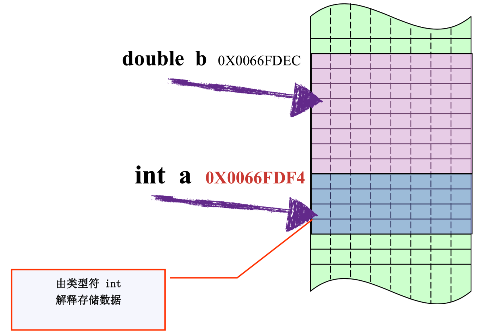
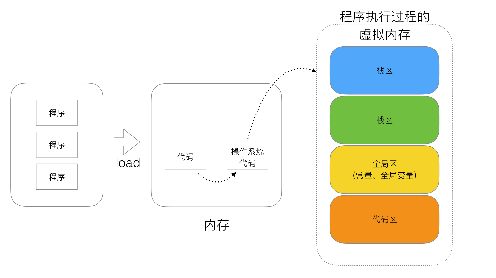

[TOC]

## 1、数据定义


### (1).函数返回值问题

> 下面代码是否可以编译通过？

> test1.go

```go
package main

/*
    下面代码是否编译通过?
*/
func myFunc(x,y int)(sum int,error){
    return x+y,nil
}

func main() {
    num, err := myFunc(1, 2)
    fmt.Println("num = ", num)
}

```


答案:

编译报错理由:

```bash
# command-line-arguments
./test1.go:6:21: syntax error: mixed named and unnamed function parameters
```


> 考点：函数返回值命名

> 结果：编译出错。

> 在函数有多个返回值时，只要有一个返回值有指定命名，其他的也必须有命名。 如果返回值有有多个返回值必须加上括号； 如果只有一个返回值并且有命名也需要加上括号； 此处函数第一个返回值有sum名称，第二个未命名，所以错误。


### (2).结构体比较问题

> 下面代码是否可以编译通过？为什么？

> test2.go

```go
package main

import "fmt"

func main() {

	sn1 := struct {
		age  int
		name string
	}{age: 11, name: "qq"}

	sn2 := struct {
		age  int
		name string
	}{age: 11, name: "qq"}

	if sn1 == sn2 {
		fmt.Println("sn1 == sn2")
	}

	sm1 := struct {
		age int
		m   map[string]string
	}{age: 11, m: map[string]string{"a": "1"}}

	sm2 := struct {
		age int
		m   map[string]string
	}{age: 11, m: map[string]string{"a": "1"}}

	if sm1 == sm2 {
		fmt.Println("sm1 == sm2")
	}
}

```

结果

编译不通过

```bash
./test2.go:31:9: invalid operation: sm1 == sm2 (struct containing map[string]string cannot be compared)

```

考点:**结构体比较** 

> **结构体比较规则注意1**：只有相同类型的结构体才可以比较，结构体是否相同不但与属性类型个数有关，还与属性顺序相关. 

比如：

```go
sn1 := struct {
	age  int
	name string
}{age: 11, name: "qq"}

sn3:= struct {
    name string
    age  int
}{age:11, name:"qq"}
```

`sn3`与`sn1`就不是相同的结构体了，不能比较。 


>  **结构体比较规则注意2**：结构体是相同的，但是结构体属性中有不可以比较的类型，如`map`,`slice`，则结构体不能用`==`比较。


可以使用reflect.DeepEqual进行比较

```go
if reflect.DeepEqual(sm1, sm2) {
		fmt.Println("sm1 == sm2")
} else {
		fmt.Println("sm1 != sm2")
}
```


### (3).string与nil类型

> 下面代码是否能够编译通过？为什么？

> test3.go

```go
package main

import (
    "fmt"
)

func GetValue(m map[int]string, id int) (string, bool) {
	if _, exist := m[id]; exist {
		return "存在数据", true
	}
	return nil, false
}

func main()  {
	intmap:=map[int]string{
		1:"a",
		2:"bb",
		3:"ccc",
	}

	v,err:=GetValue(intmap,3)
	fmt.Println(v,err)
}

```

考点：**函数返回值类型** 

答案：编译不会通过。

分析：

 nil 可以用作 interface、function、pointer、map、slice 和 channel 的“空值”。但是如果不特别指定的话，Go 语言不能识别类型，所以会报错。通常编译的时候不会报错，但是运行是时候会报:`cannot use nil as type string in return argument`.

所以将`GetValue`函数改成如下形式就可以了

```go
func GetValue(m map[int]string, id int) (string, bool) {
	if _, exist := m[id]; exist {
		return "存在数据", true
	}
    return "不存在数据", false
}
```

### (4) 常量

>  下面函数有什么问题？

> test4.go

```go
package main

const cl = 100

var bl = 123

func main()  {
    println(&bl,bl)
    println(&cl,cl)
}
```

解析

考点:**常量**
常量不同于变量的在运行期分配内存，常量通常会被编译器在预处理阶段直接展开，作为指令数据使用，

```
cannot take the address of cl
```


内存四区概念：

#### A.数据类型本质：

​	固定内存大小的别名

#### B. 数据类型的作用：

​	编译器预算对象(变量)分配的内存空间大小。




#### C. 内存四区



流程说明 

1、操作系统把物理硬盘代码load到内存 

2、操作系统把c代码分成四个区 

3、操作系统找到main函数入口执行


##### 栈区(Stack)：

​		空间较小，要求数据读写性能高，数据存放时间较短暂。由编译器自动分配和释放，存放函数的参数值、函数的调用流程方法地址、局部变量等(局部变量如果产生逃逸现象，可能会挂在在堆区)


##### 堆区(heap):

​		空间充裕，数据存放时间较久。一般由开发者分配及释放(但是Golang中会根据变量的逃逸现象来选择是否分配到栈上或堆上)，启动Golang的GC由GC清除机制自动回收。


##### 全局区-静态全局变量区:

​		全局变量的开辟是在程序在`main`之前就已经放在内存中。而且对外完全可见。即作用域在全部代码中，任何同包代码均可随时使用，在变量会搞混淆，而且在局部函数中如果同名称变量使用`:=`赋值会出现编译错误。

​		全局变量最终在进程退出时，由操作系统回收。

		> 我么在开发的时候，尽量减少使用全局变量的设计


###### 全局区-常量区： 

​		常量区也归属于全局区，常量为存放数值字面值单位，即不可修改。或者说的有的常量是直接挂钩字面值的。

比如:

```go
const cl = 10
```

cl是字面量10的对等符号。

所以在golang中，常量是无法取出地址的，因为字面量符号并没有地址而言。

---


