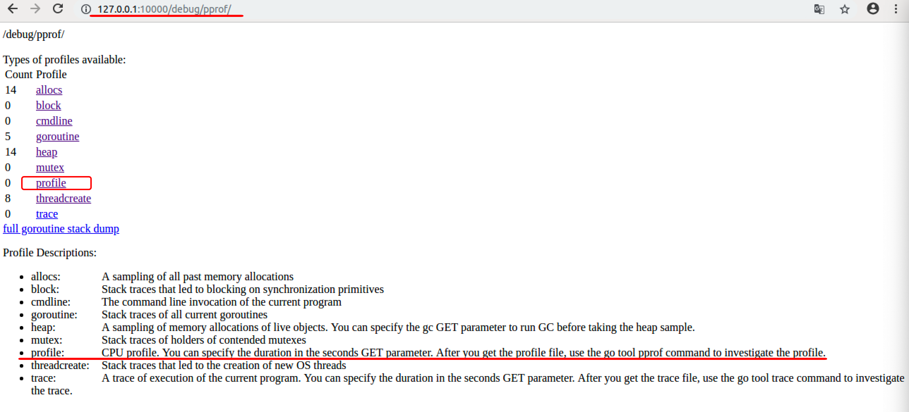
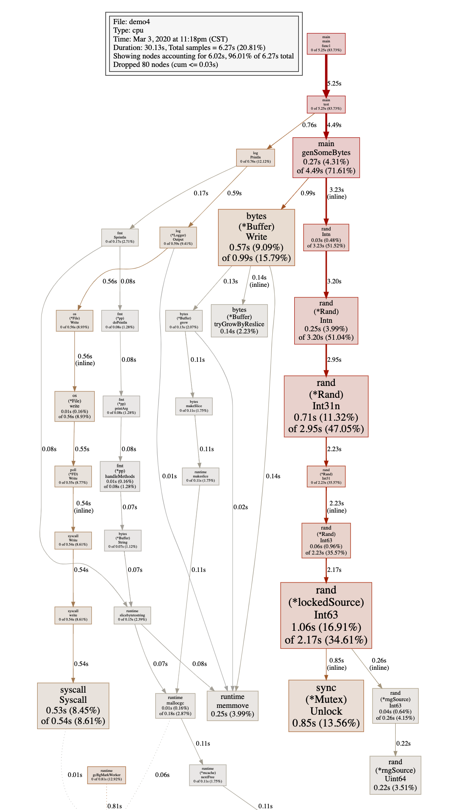

[TOC]

# 1、最常用的调试 golang 的 bug 以及性能问题的实践方法？
> 本节为**重点**章节


## 场景1： 如何分析程序的运行时间与CPU利用率情况？

### (1) shell内置time指令

这个方法不算新颖，但是确很实用。 `time`是Unix/Linux内置多命令，使用时一般不用传过多参数，直接跟上需要调试多程序即可。


```bash
$ time go run test2.go 
&{{0 0} 张三 0}

real	0m0.843s
user	0m0.216s
sys	0m0.389s
```


上面是使用time对 `go run test2.go`对执行程序坐了性能分析，得到3个指标。

- `real`：从程序开始到结束，实际度过的时间；
- `user`：程序在**用户态**度过的时间；
- `sys`：程序在**内核态**度过的时间。

一般情况下 `real` **>=** `user` + `sys`，因为系统还有其它进程(切换其他进程中间对于本进程会有空白期)。


### (2) /usr/bin/time指令

这个指令比内置的time更加详细一些，使用的时候需要用绝对路径，而且要加上参数`-v `

```bash
$ /usr/bin/time -v go run test2.go  

	Command being timed: "go run test2.go"
	User time (seconds): 0.12
	System time (seconds): 0.06
	Percent of CPU this job got: 115%
	Elapsed (wall clock) time (h:mm:ss or m:ss): 0:00.16
	Average shared text size (kbytes): 0
	Average unshared data size (kbytes): 0
	Average stack size (kbytes): 0
	Average total size (kbytes): 0
	Maximum resident set size (kbytes): 41172
	Average resident set size (kbytes): 0
	Major (requiring I/O) page faults: 1
	Minor (reclaiming a frame) page faults: 15880
	Voluntary context switches: 897
	Involuntary context switches: 183
	Swaps: 0
	File system inputs: 256
	File system outputs: 2664
	Socket messages sent: 0
	Socket messages received: 0
	Signals delivered: 0
	Page size (bytes): 4096
	Exit status: 0

```

可以看到这里的功能要强大多了，除了之前的信息外，还包括了：

- CPU占用率；
- 内存使用情况；
- Page Fault 情况；
- 进程切换情况；
- 文件系统IO；
- Socket 使用情况；
- ……


## 场景2： 如何分析golang程序的内存使用情况？


### (1) 内存占用情况查看

我们先写一段demo例子代码

```go
package main

import (
    "log"
    "runtime"
    "time"
)

func test() {
    //slice 会动态扩容，用slice来做堆内存申请
    container := make([]int, 8)

    log.Println(" ===> loop begin.")
    for i := 0; i < 32*1000*1000; i++ {
        container = append(container, i)
    }
    log.Println(" ===> loop end.")
}

func main() {
    log.Println("Start.")

    test()

    log.Println("force gc.")
    runtime.GC() //强制调用gc回收

    log.Println("Done.")

    time.Sleep(3600 * time.Second) //睡眠，保持程序不退出
}

```


编译

```bash
$go build -o snippet_mem && ./snippet_mem
```


然后在./snippet_mem进程没有执行完，我们再开一个窗口，通过`top`命令查看进程的内存占用情况

```bash
$top -p $(pidof snippet_mem)
```

得到结果如下：


我们看出来，没有退出的snippet_mem进程有约830m的内存被占用。

直观上来说，这个程序在`test()`函数执行完后，切片`contaner`的内存应该被释放，不应该占用830M那么大。

下面让我们使用GODEBUG来分析程序的内存使用情况。

---


### (2) GODEBUG与gctrace

**用法**

执行`snippet_mem`程序之前添加环境变量`GODEBUG='gctrace=1'`来跟踪打印垃圾回收器信息

```bash
$ GODEBUG='gctrace=1' ./snippet_mem
```

设置`gctrace=1`会使得垃圾回收器在每次回收时汇总所回收内存的大小以及耗时，
并将这些内容汇总成单行内容打印到标准错误输出中。

**格式**

```
gc # @#s #%: #+#+# ms clock, #+#/#/#+# ms cpu, #->#-># MB, # MB goal, # P
```

含义

```
	gc #        GC次数的编号，每次GC时递增
	@#s         距离程序开始执行时的时间
	#%          GC占用的执行时间百分比
	#+...+#     GC使用的时间
	#->#-># MB  GC开始，结束，以及当前活跃堆内存的大小，单位M
	# MB goal   全局堆内存大小
	# P         使用processor的数量
```

如果每条信息最后，以`(forced)`结尾，那么该信息是由`runtime.GC()`调用触发

我们来选择其中一行来解释一下：

```bash
gc 17 @0.149s 1%: 0.004+36+0.003 ms clock, 0.009+0/0.051/36+0.006 ms cpu, 181->181->101 MB, 182 MB goal, 2 P
```

该条信息含义如下：

* `gc 17`: Gc 调试编号为17
* `@0.149s`:此时程序已经执行了0.149s
* `1%`: 0.149s中其中gc模块占用了1%的时间
* `0.004+36+0.003 ms clock`: 垃圾回收的时间，分别为STW（stop-the-world）清扫的时间+并发标记和扫描的时间+STW标记的时间
* `0.009+0/0.051/36+0.006 ms cpu`: 垃圾回收占用cpu时间
* `181->181->101 MB`： GC开始前堆内存181M， GC结束后堆内存181M，当前活跃的堆内存101M
* `182 MB goal`: 全局堆内存大小
* `2 P`: 本次GC使用了2个P(调度器中的Processer)

---


了解了GC的调试信息读法后，接下来我们来分析一下本次GC的结果。

我们还是执行GODEBUG调试

```bash
$ GODEBUG='gctrace=1' ./snippet_mem
```

结果如下

```bash
2020/03/02 11:22:37 Start.
2020/03/02 11:22:37  ===> loop begin.
gc 1 @0.002s 5%: 0.14+0.45+0.002 ms clock, 0.29+0/0.042/0.33+0.005 ms cpu, 4->4->0 MB, 5 MB goal, 2 P
gc 2 @0.003s 4%: 0.13+3.7+0.019 ms clock, 0.27+0/0.037/2.8+0.038 ms cpu, 4->4->2 MB, 5 MB goal, 2 P
gc 3 @0.008s 3%: 0.002+1.1+0.001 ms clock, 0.005+0/0.083/1.0+0.003 ms cpu, 6->6->2 MB, 7 MB goal, 2 P
gc 4 @0.010s 3%: 0.003+0.99+0.002 ms clock, 0.006+0/0.041/0.82+0.004 ms cpu, 5->5->2 MB, 6 MB goal, 2 P
gc 5 @0.011s 4%: 0.079+0.80+0.003 ms clock, 0.15+0/0.046/0.51+0.006 ms cpu, 6->6->3 MB, 7 MB goal, 2 P
gc 6 @0.013s 4%: 0.15+3.7+0.002 ms clock, 0.31+0/0.061/3.3+0.005 ms cpu, 8->8->8 MB, 9 MB goal, 2 P
gc 7 @0.019s 3%: 0.004+2.5+0.005 ms clock, 0.008+0/0.051/2.1+0.010 ms cpu, 20->20->6 MB, 21 MB goal, 2 P
gc 8 @0.023s 5%: 0.014+3.7+0.002 ms clock, 0.029+0.040/1.2/0+0.005 ms cpu, 15->15->8 MB, 16 MB goal, 2 P
gc 9 @0.031s 4%: 0.003+1.6+0.001 ms clock, 0.007+0.094/0/0+0.003 ms cpu, 19->19->10 MB, 20 MB goal, 2 P
gc 10 @0.034s 3%: 0.006+5.2+0.004 ms clock, 0.013+0/0.045/5.0+0.008 ms cpu, 24->24->13 MB, 25 MB goal, 2 P
gc 11 @0.040s 3%: 0.12+2.6+0.002 ms clock, 0.24+0/0.043/2.5+0.004 ms cpu, 30->30->16 MB, 31 MB goal, 2 P
gc 12 @0.043s 3%: 0.11+4.4+0.002 ms clock, 0.23+0/0.044/4.1+0.005 ms cpu, 38->38->21 MB, 39 MB goal, 2 P
gc 13 @0.049s 3%: 0.008+10+0.040 ms clock, 0.017+0/0.045/10+0.080 ms cpu, 47->47->47 MB, 48 MB goal, 2 P
gc 14 @0.070s 2%: 0.004+12+0.002 ms clock, 0.008+0/0.062/12+0.005 ms cpu, 122->122->41 MB, 123 MB goal, 2 P
gc 15 @0.084s 2%: 0.11+11+0.038 ms clock, 0.22+0/0.064/3.9+0.076 ms cpu, 93->93->93 MB, 94 MB goal, 2 P
gc 16 @0.122s 1%: 0.005+25+0.010 ms clock, 0.011+0/0.12/24+0.021 ms cpu, 238->238->80 MB, 239 MB goal, 2 P
gc 17 @0.149s 1%: 0.004+36+0.003 ms clock, 0.009+0/0.051/36+0.006 ms cpu, 181->181->101 MB, 182 MB goal, 2 P
gc 18 @0.187s 1%: 0.12+19+0.004 ms clock, 0.25+0/0.049/19+0.008 ms cpu, 227->227->126 MB, 228 MB goal, 2 P
gc 19 @0.207s 1%: 0.096+27+0.004 ms clock, 0.19+0/0.077/0.73+0.009 ms cpu, 284->284->284 MB, 285 MB goal, 2 P
gc 20 @0.287s 0%: 0.005+944+0.040 ms clock, 0.011+0/0.048/1.3+0.081 ms cpu, 728->728->444 MB, 729 MB goal, 2 P
2020/03/02 11:22:38  ===> loop end.
2020/03/02 11:22:38 force gc.
gc 21 @1.236s 0%: 0.004+0.099+0.001 ms clock, 0.008+0/0.018/0.071+0.003 ms cpu, 444->444->0 MB, 888 MB goal, 2 P (forced)
2020/03/02 11:22:38 Done.
GC forced
gc 22 @122.455s 0%: 0.010+0.15+0.003 ms clock, 0.021+0/0.025/0.093+0.007 ms cpu, 0->0->0 MB, 4 MB goal, 2 P
GC forced
gc 23 @242.543s 0%: 0.007+0.075+0.002 ms clock, 0.014+0/0.022/0.085+0.004 ms cpu, 0->0->0 MB, 4 MB goal, 2 P
GC forced
gc 24 @362.545s 0%: 0.018+0.19+0.006 ms clock, 0.037+0/0.055/0.15+0.013 ms cpu, 0->0->0 MB, 4 MB goal, 2 P
GC forced
gc 25 @482.548s 0%: 0.012+0.25+0.005 ms clock, 0.025+0/0.025/0.11+0.010 ms cpu, 0->0->0 MB, 4 MB goal, 2 P
GC forced
gc 26 @602.551s 0%: 0.009+0.10+0.003 ms clock, 0.018+0/0.021/0.075+0.006 ms cpu, 0->0->0 MB, 4 MB goal, 2 P
GC forced
gc 27 @722.554s 0%: 0.012+0.30+0.005 ms clock, 0.025+0/0.15/0.22+0.011 ms cpu, 0->0->0 MB, 4 MB goal, 2 P
GC forced
gc 28 @842.556s 0%: 0.027+0.18+0.003 ms clock, 0.054+0/0.11/0.14+0.006 ms cpu, 0->0->0 MB, 4 MB goal, 2 P
...
```

**分析**

​	先看在`test()`函数执行完后立即打印的`gc 21`那行的信息。`444->444->0 MB, 888 MB goal`表示垃圾回收器已经把444M的内存标记为非活跃的内存。

再看下一个记录`gc 22`。`0->0->0 MB, 4 MB goal`表示垃圾回收器中的全局堆内存大小由`888M`下降为`4M`。

**结论**

**1、在test()函数执行完后，demo程序中的切片容器所申请的堆空间都被垃圾回收器回收了。**

2、如果此时在`top`指令查询内存的时候，如果依然是800+MB，说明**垃圾回收器回收了应用层的内存后，（可能）并不会立即将内存归还给系统。**


### (3)runtime.ReadMemStats

接下来我么换另一种方式查看内存的方式 利用 runtime库里的`ReadMemStats()`方法

> demo2.go

```go
package main

import (
    "log"
    "runtime"
    "time"
)

func readMemStats() {

    var ms runtime.MemStats

    runtime.ReadMemStats(&ms)

    log.Printf(" ===> Alloc:%d(bytes) HeapIdle:%d(bytes) HeapReleased:%d(bytes)", ms.Alloc, ms.HeapIdle, ms.HeapReleased)
}

func test() {
    //slice 会动态扩容，用slice来做堆内存申请
    container := make([]int, 8)

    log.Println(" ===> loop begin.")
    for i := 0; i < 32*1000*1000; i++ {
        container = append(container, i)
        if ( i == 16*1000*1000) {
            readMemStats()
        }
    }

    log.Println(" ===> loop end.")
}

func main() {
    log.Println(" ===> [Start].")

    readMemStats()
    test()
    readMemStats()

    log.Println(" ===> [force gc].")
    runtime.GC() //强制调用gc回收

    log.Println(" ===> [Done].")
    readMemStats()

    go func() {
        for {
            readMemStats()
            time.Sleep(10 * time.Second)
        }
    }()

    time.Sleep(3600 * time.Second) //睡眠，保持程序不退出
}
```

这里我们， 封装了一个函数`readMemStats()`，这里面主要是调用`runtime`中的`ReadMemStats()`方法获得内存信息，然后通过`log`打印出来。

我们执行一下代码并运行


```bash
$ go run demo2.go 
2020/03/02 18:21:17  ===> [Start].
2020/03/02 18:21:17  ===> Alloc:71280(bytes) HeapIdle:66633728(bytes) HeapReleased:66600960(bytes)
2020/03/02 18:21:17  ===> loop begin.
2020/03/02 18:21:18  ===> Alloc:132535744(bytes) HeapIdle:336756736(bytes) HeapReleased:155721728(bytes)
2020/03/02 18:21:38  ===> loop end.
2020/03/02 18:21:38  ===> Alloc:598300600(bytes) HeapIdle:609181696(bytes) HeapReleased:434323456(bytes)
2020/03/02 18:21:38  ===> [force gc].
2020/03/02 18:21:38  ===> [Done].
2020/03/02 18:21:38  ===> Alloc:55840(bytes) HeapIdle:1207427072(bytes) HeapReleased:434266112(bytes)
2020/03/02 18:21:38  ===> Alloc:56656(bytes) HeapIdle:1207394304(bytes) HeapReleased:434266112(bytes)
2020/03/02 18:21:48  ===> Alloc:56912(bytes) HeapIdle:1207394304(bytes) HeapReleased:1206493184(bytes)
2020/03/02 18:21:58  ===> Alloc:57488(bytes) HeapIdle:1207394304(bytes) HeapReleased:1206493184(bytes)
2020/03/02 18:22:08  ===> Alloc:57616(bytes) HeapIdle:1207394304(bytes) HeapReleased:1206493184(bytes)
c2020/03/02 18:22:18  ===> Alloc:57744(bytes) HeapIdle:1207394304(bytes) HeapReleased:1206493184(by
```

​		可以看到，打印`[Done].`之后那条trace信息，Alloc已经下降，即内存已被垃圾回收器回收。在`2020/03/02 18:21:38`和`2020/03/02 18:21:48`的两条trace信息中，HeapReleased开始上升，即垃圾回收器把内存归还给系统。

另外，MemStats还可以获取其它哪些信息以及字段的含义可以参见官方文档：

> http://golang.org/pkg/runtime/#MemStats


### (4)pprof工具

pprof工具支持网页上查看内存的使用情况，需要在代码中添加一个协程即可。

```go
import(
	"net/http"
	_ "net/http/pprof"
)

go func() {
	log.Println(http.ListenAndServe("0.0.0.0:10000", nil))
}()
```

具体添加的完整代码如下：

> demo3.go

```go
package main

import (
    "log"
    "runtime"
    "time"
    "net/http"
    _ "net/http/pprof"
)

func readMemStats() {

    var ms runtime.MemStats

    runtime.ReadMemStats(&ms)

    log.Printf(" ===> Alloc:%d(bytes) HeapIdle:%d(bytes) HeapReleased:%d(bytes)", ms.Alloc, ms.HeapIdle, ms.HeapReleased)
}

func test() {
    //slice 会动态扩容，用slice来做堆内存申请
    container := make([]int, 8)

    log.Println(" ===> loop begin.")
    for i := 0; i < 32*1000*1000; i++ {
        container = append(container, i)
        if ( i == 16*1000*1000) {
            readMemStats()
        }
    }

    log.Println(" ===> loop end.")
}

func main() {


    //启动pprof
    go func() {
        log.Println(http.ListenAndServe("0.0.0.0:10000", nil))
    }()

    log.Println(" ===> [Start].")

    readMemStats()
    test()
    readMemStats()

    log.Println(" ===> [force gc].")
    runtime.GC() //强制调用gc回收

    log.Println(" ===> [Done].")
    readMemStats()

    go func() {
        for {
            readMemStats()
            time.Sleep(10 * time.Second)
        }
    }()

    time.Sleep(3600 * time.Second) //睡眠，保持程序不退出
}

```

我们正常运行程序，然后同时打开浏览器，

输入地址：http://127.0.0.1:10000/debug/pprof/heap?debug=1

浏览器的内容其中有一部分如下，记录了目前的内存情况

```bash
# ...

# runtime.MemStats
# Alloc = 228248
# TotalAlloc = 1293696976
# Sys = 834967896
# Lookups = 0
# Mallocs = 2018
# Frees = 671
# HeapAlloc = 228248
# HeapSys = 804913152
# HeapIdle = 804102144
# HeapInuse = 811008
# HeapReleased = 108552192
# HeapObjects = 1347
# Stack = 360448 / 360448
# MSpan = 28288 / 32768
# MCache = 3472 / 16384
# BuckHashSys = 1449617
# GCSys = 27418976
# OtherSys = 776551
# NextGC = 4194304
# LastGC = 1583203571137891390

# ...
```


## 场景3: 如何分析Golang程序的CPU性能情况？


### (1)性能分析注意事项 

- 性能分析必须在一个

  可重复的、稳定的环境中来进行。

  - 机器必须闲置
    - 不要在共享硬件上进行性能分析;
    - 不要在性能分析期间，在同一个机器上去浏览网页
  - 注意省电模式和过热保护，如果突然进入这些模式，会导致分析数据严重不准确
  - **不要使用虚拟机、共享的云主机**，太多干扰因素，分析数据会很不一致；
  - 不要在 macOS 10.11 及以前的版本运行性能分析，有 bug，之后的版本修复了。

如果承受得起，购买专用的性能测试分析的硬件设备，上架。

- 关闭电源管理、过热管理;
- 绝不要升级，以保证测试的一致性，以及具有可比性。

如果没有这样的环境，那就一定要在多个环境中，执行多次，以取得可参考的、具有相对一致性的测试结果。


### (2) CPU性能分析

我们来用下面的代码进行测试

> demo4.go

```go
package main

import (
    "bytes"
    "math/rand"
    "time"
    "log"
    "net/http"
    _ "net/http/pprof"
)


func test() {

    log.Println(" ===> loop begin.")
    for i := 0; i < 1000; i++ {
        log.Println(genSomeBytes())
    }

    log.Println(" ===> loop end.")
}

//生成一个随机字符串
func genSomeBytes() *bytes.Buffer {

    var buff bytes.Buffer

    for i := 1; i < 20000; i++ {
        buff.Write([]byte{'0' + byte(rand.Intn(10))})
    }

    return &buff
}

func main() {

    go func() {
        for {
            test()
            time.Sleep(time.Second * 1)
        }
    }()

    //启动pprof
    http.ListenAndServe("0.0.0.0:10000", nil)

}

```

这里面还是启动了pprof的坚挺,有关`pprof`启动的代码如下

```go
import (
    "net/http"
    _ "net/http/pprof"
)

func main() {
	//...
  //...
  
  //启动pprof
  http.ListenAndServe("0.0.0.0:10000", nil)
}
```

`main()`里的流程很简单,启动一个goroutine去无限循环调用`test()`方法,休眠1s.

`test()`的流程是生成1000个20000个字符的随机字符串.并且打印.

我们将上面的代码编译成可执行的二进制文件 `demo4`(记住这个名字,稍后我们能用到)

```bash
$ go build demo4.go
```


接下来我们启动程序,程序会无限循环的打印字符串.

接下来我们通过几种方式来查看进程的cpu性能情况.


#### A. Web界面查看

浏览器访问http://127.0.0.1:10000/debug/pprof/

我们会看到如下画面



这里面能够通过pprof查看包括(阻塞信息、cpu信息、内存堆信息、锁信息、goroutine信息等等), 我们这里关心的cpu的性能的`profile`信息.

有关`profile`下面的英文解释大致如下:

> “CPU配置文件。您可以在秒GET参数中指定持续时间。获取概要文件后，请使用go tool pprof命令调查概要文件。”

所以我们要是想得到cpu性能,就是要获取到当前进程的`profile`文件,这个文件默认是30s生成一个,所以你的程序要至少运行30s以上(这个参数也可以修改,稍后我们介绍)

我们可以直接点击网页的`profile`,浏览器会给我们下载一个`profile`文件. 记住这个文件的路径, 可以拷贝到与`demo4`所在的同一文件夹下.


#### B. 使用pprof工具查看

pprof 的格式如下

```bash
go tool pprof [binary] [profile]
```

binary: 必须指向生成这个性能分析数据的那个二进制可执行文件；

profile: 必须是该二进制可执行文件所生成的性能分析数据文件。

**`binary` 和 `profile` 必须严格匹配**。

我们来查看一下:

```bash
$ go tool pprof ./demo4 profile

File: demo4
Type: cpu
Time: Mar 3, 2020 at 11:18pm (CST)
Duration: 30.13s, Total samples = 6.27s (20.81%)
Entering interactive mode (type "help" for commands, "o" for options)
(pprof) 
```

**help**可以查看一些指令,我么可以通过**top**来查看cpu的性能情况.

```bash
(pprof) top
Showing nodes accounting for 5090ms, 81.18% of 6270ms total
Dropped 80 nodes (cum <= 31.35ms)
Showing top 10 nodes out of 60
      flat  flat%   sum%        cum   cum%
    1060ms 16.91% 16.91%     2170ms 34.61%  math/rand.(*lockedSource).Int63
     850ms 13.56% 30.46%      850ms 13.56%  sync.(*Mutex).Unlock (inline)
     710ms 11.32% 41.79%     2950ms 47.05%  math/rand.(*Rand).Int31n
     570ms  9.09% 50.88%      990ms 15.79%  bytes.(*Buffer).Write
     530ms  8.45% 59.33%      540ms  8.61%  syscall.Syscall
     370ms  5.90% 65.23%      370ms  5.90%  runtime.procyield
     270ms  4.31% 69.54%     4490ms 71.61%  main.genSomeBytes
     250ms  3.99% 73.52%     3200ms 51.04%  math/rand.(*Rand).Intn
     250ms  3.99% 77.51%      250ms  3.99%  runtime.memmove
     230ms  3.67% 81.18%      690ms 11.00%  runtime.suspendG
(pprof) 

```

这里面有几列数据,需要说明一下.

- flat：当前函数占用CPU的耗时
- flat%：:当前函数占用CPU的耗时百分比
- sun%：函数占用CPU的耗时累计百分比
- cum：当前函数加上调用当前函数的函数占用CPU的总耗时
- cum%：当前函数加上调用当前函数的函数占用CPU的总耗时百分比
- 最后一列：函数名称

通过结果我们可以看出, 该程序的大部分cpu性能消耗在 `main.getSoneBytes()`方法中,其中math/rand取随机数消耗比较大.


#### C. 通过go tool pprof得到profile文件

我们上面的profile文件是通过web浏览器下载的,这个profile的经过时间是30s的,默认值我们在浏览器上修改不了,如果你想得到时间更长的cpu利用率,可以通过`go tool pprof`指令与程序交互来获取到

首先,我们先启动程序

```
$ ./demo4
```

然后再打开一个终端

```bash
go tool pprof http://localhost:10000/debug/pprof/profile?seconds=60
```

这里制定了生成profile文件的时间间隔60s

等待60s之后, 终端就会有结果出来,我们继续使用top来查看.

```bash
$ go tool pprof http://localhost:10000/debug/pprof/profile?seconds=60
Fetching profile over HTTP from http://localhost:10000/debug/pprof/profile?seconds=60
Saved profile in /home/itheima/pprof/pprof.demo4.samples.cpu.005.pb.gz
File: demo4
Type: cpu
Time: Mar 3, 2020 at 11:59pm (CST)
Duration: 1mins, Total samples = 12.13s (20.22%)
Entering interactive mode (type "help" for commands, "o" for options)
(pprof) top
Showing nodes accounting for 9940ms, 81.95% of 12130ms total
Dropped 110 nodes (cum <= 60.65ms)
Showing top 10 nodes out of 56
      flat  flat%   sum%        cum   cum%
    2350ms 19.37% 19.37%     4690ms 38.66%  math/rand.(*lockedSource).Int63
    1770ms 14.59% 33.97%     1770ms 14.59%  sync.(*Mutex).Unlock (inline)
    1290ms 10.63% 44.60%     6040ms 49.79%  math/rand.(*Rand).Int31n
    1110ms  9.15% 53.75%     1130ms  9.32%  syscall.Syscall
     810ms  6.68% 60.43%     1860ms 15.33%  bytes.(*Buffer).Write
     620ms  5.11% 65.54%     6660ms 54.91%  math/rand.(*Rand).Intn
     570ms  4.70% 70.24%      570ms  4.70%  runtime.procyield
     500ms  4.12% 74.36%     9170ms 75.60%  main.genSomeBytes
     480ms  3.96% 78.32%      480ms  3.96%  runtime.memmove
     440ms  3.63% 81.95%      440ms  3.63%  math/rand.(*rngSource).Uint64
(pprof) 

```

依然会得到cpu性能的结果, 我们发现这次的结果与上次30s的结果百分比类似.


#### D.可视化查看

我们还是通过

```bash
$ go tool pprof ./demo4 profile
```

进入profile文件查看,然后我们输入`web`指令.

```bash
$ go tool pprof ./demo4 profileFile: demo4
Type: cpu
Time: Mar 3, 2020 at 11:18pm (CST)
Duration: 30.13s, Total samples = 6.27s (20.81%)
Entering interactive mode (type "help" for commands, "o" for options)
(pprof) web

```

这里如果报找不到`graphviz`工具,需要安装一下

**Ubuntu安装**

```
$sudo apt-get install graphviz
```

**Mac安装**

```
brew install graphviz
```

**windows安装**

下载https://graphviz.gitlab.io/_pages/Download/Download_windows.html 

```bash
将graphviz安装目录下的bin文件夹添加到Path环境变量中。 在终端输入dot -version查看是否安装成功。
```


然后我们得到一个svg的可视化文件在`/tmp`路径下



这样我们就能比较清晰的看到函数之间的调用关系,方块越大的表示cpu的占用越大.


