[TOC]

## 1、流？I/O操作？阻塞？epoll?

### 一、流？I/O操作? 阻塞？

#### (1) 流

- 可以进行I/O操作的内核对象
- 文件、管道、套接字……
- 流的入口：文件描述符(fd)

#### (2) I/O操作

所有对流的读写操作，我们都可以称之为IO操作。


当一个流中， 在没有数据read的时候，或者说在流中已经写满了数据，再write，我们的IO操作就会出现一种现象，就是阻塞现象，如下图。


---


#### (3) 阻塞
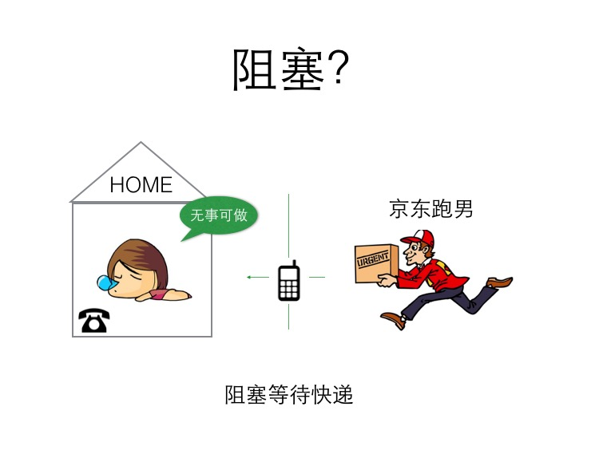

​		**阻塞场景**: 你有一份快递，家里有个座机，快递到了主动给你打电话，期间你可以休息。
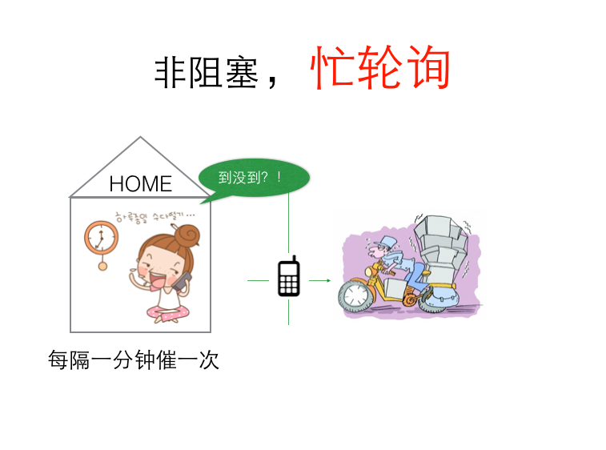

   **非阻塞，忙轮询场景**: 你性子比较急躁， 每分钟就要打电话询问快递小哥一次， 到底有没有到，快递员接你电话要停止运输，这样很耽误快递小哥的运输速度。


* 阻塞等待

空出大脑可以安心睡觉,  不影响快递员工作（不占用CPU宝贵的时间片）。

- 非阻塞，忙轮询

浪费时间，浪费电话费，占用快递员时间（占用CPU，系统资源）。


很明显，阻塞等待这种方式，对于通信上是有明显优势的， 那么它有哪些弊端呢？


### 二、解决阻塞死等待的办法

#### 阻塞死等待的缺点
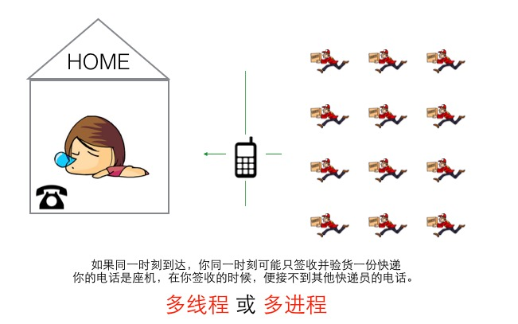

​		也就是同一时刻，你只能被动的处理一个快递员的签收业务，其他快递员打电话打不进来，只能干瞪眼等待。那么解决这个问题，家里多买N个座机， 但是依然是你一个人接，也处理不过来，需要用影分身术创建都个自己来接电话(采用多线程或者多进程）来处理。

​		这种方式就是没有多路IO复用的情况的解决方案， 但是在单线程计算机时代(无法影分身)，这简直是灾难。


---


那么如果我们不借助影分身的方式(多线程/多进程)，该如何解决阻塞死等待的方法呢？

#### 办法一：非阻塞、忙轮询

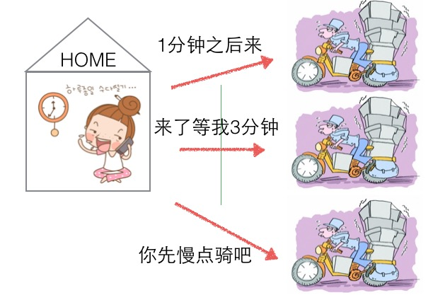

```go
while true {
	for i in 流[] {
		if i has 数据 {
			读 或者 其他处理
		}
	}
}
```

非阻塞忙轮询的方式，可以让用户分别与每个快递员取得联系，宏观上来看，是同时可以与多个快递员沟通(并发效果)、 但是快递员在于用户沟通时耽误前进的速度(浪费CPU)。

---

#### 办法二：select
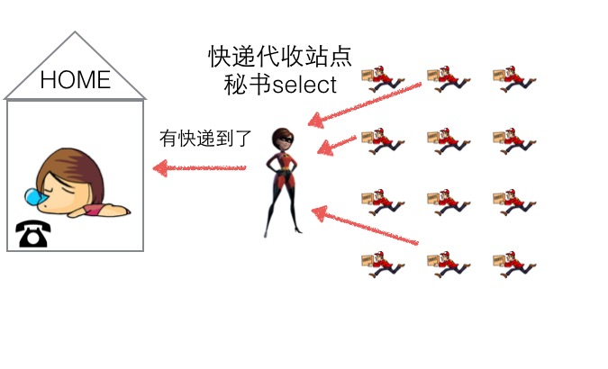

我们可以开设一个代收网点，让快递员全部送到代收点。这个网店管理员叫select。这样我们就可以在家休息了，麻烦的事交给select就好了。当有快递的时候，select负责给我们打电话，期间在家休息睡觉就好了。


但select 代收员比较懒，她记不住快递员的单号，还有快递货物的数量。她只会告诉你快递到了，但是是谁到的，你需要挨个快递员问一遍。

```go
while true {
	select(流[]); //阻塞

  //有消息抵达
	for i in 流[] {
		if i has 数据 {
			读 或者 其他处理
		}
	}
}
```

---

#### 办法三：epoll

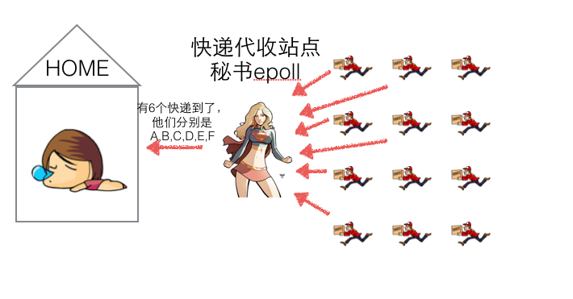

epoll的服务态度要比select好很多，在通知我们的时候，不仅告诉我们有几个快递到了，还分别告诉我们是谁谁谁。我们只需要按照epoll给的答复，来询问快递员取快递即可。

```go
while true {
	可处理的流[] = epoll_wait(epoll_fd); //阻塞

  //有消息抵达，全部放在 “可处理的流[]”中
	for i in 可处理的流[] {
		读 或者 其他处理
	}
}
```

---

### 三、epoll？

- 与select，poll一样，对I/O多路复用的技术
- 只关心“活跃”的链接，无需遍历全部描述符集合
- 能够处理大量的链接请求(系统可以打开的文件数目)

### 四、epoll的API

#### (1) 创建EPOLL

```c
/** 
 * @param size 告诉内核监听的数目 
 * 
 * @returns 返回一个epoll句柄（即一个文件描述符） 
 */
int epoll_create(int size);
```

使用

```c
int epfd = epoll_create(1000);
```
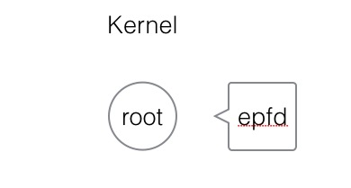

创建一个epoll句柄，实际上是在内核空间，建立一个root根节点，这个根节点的关系与epfd相对应。


#### (2) 控制EPOLL

```c
/**
* @param epfd 用epoll_create所创建的epoll句柄
* @param op 表示对epoll监控描述符控制的动作
*
* EPOLL_CTL_ADD(注册新的fd到epfd)
* EPOLL_CTL_MOD(修改已经注册的fd的监听事件)
* EPOLL_CTL_DEL(epfd删除一个fd)
*
* @param fd 需要监听的文件描述符
* @param event 告诉内核需要监听的事件
*
* @returns 成功返回0，失败返回-1, errno查看错误信息
*/
int epoll_ctl(int epfd, int op, int fd,
struct epoll_event *event);


struct epoll_event {
	__uint32_t events; /* epoll 事件 */
	epoll_data_t data; /* 用户传递的数据 */
}

/*
 * events : {EPOLLIN, EPOLLOUT, EPOLLPRI,
						 EPOLLHUP, EPOLLET, EPOLLONESHOT}
 */
typedef union epoll_data {
	void *ptr;
	int fd;
	uint32_t u32;
	uint64_t u64;
} epoll_data_t;
```

使用

```c
struct epoll_event new_event;

new_event.events = EPOLLIN | EPOLLOUT;
new_event.data.fd = 5;

epoll_ctl(epfd, EPOLL_CTL_ADD, 5, &new_event);
```

​		创建一个用户态的事件，绑定到某个fd上，然后添加到内核中的epoll红黑树中。

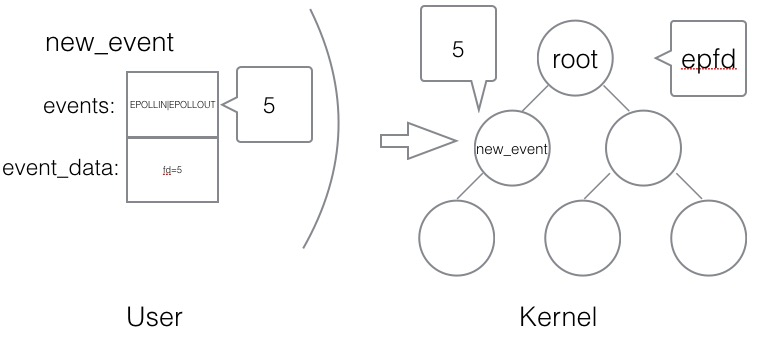

#### (3) 等待EPOLL

```c
/**
*
* @param epfd 用epoll_create所创建的epoll句柄
* @param event 从内核得到的事件集合
* @param maxevents 告知内核这个events有多大,
* 注意: 值 不能大于创建epoll_create()时的size.
* @param timeout 超时时间
* -1: 永久阻塞
* 0: 立即返回，非阻塞
* >0: 指定微秒
*
* @returns 成功: 有多少文件描述符就绪,时间到时返回0
* 失败: -1, errno 查看错误
*/
int epoll_wait(int epfd, struct epoll_event *event,
							 int maxevents, int timeout);
```

使用

```c
struct epoll_event my_event[1000];

int event_cnt = epoll_wait(epfd, my_event, 1000, -1);
```

​		`epoll_wait`是一个阻塞的状态，如果内核检测到IO的读写响应，会抛给上层的epoll_wait, 返回给用户态一个已经触发的事件队列，同时阻塞返回。开发者可以从队列中取出事件来处理，其中事件里就有绑定的对应fd是哪个(之前添加epoll事件的时候已经绑定)。

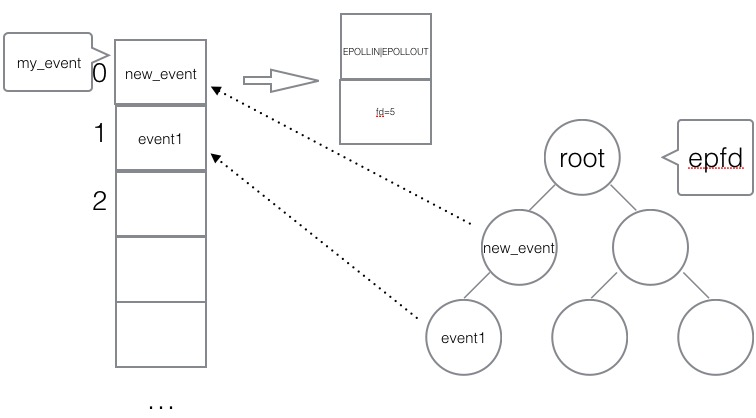


#### (4) 使用epoll编程主流程骨架

```c
int epfd = epoll_crete(1000);

//将 listen_fd 添加进 epoll 中
epoll_ctl(epfd, EPOLL_CTL_ADD, listen_fd,&listen_event);

while (1) {
	//阻塞等待 epoll 中 的fd 触发
	int active_cnt = epoll_wait(epfd, events, 1000, -1);

	for (i = 0 ; i < active_cnt; i++) {
		if (evnets[i].data.fd == listen_fd) {
			//accept. 并且将新accept 的fd 加进epoll中.
		}
		else if (events[i].events & EPOLLIN) {
			//对此fd 进行读操作
		}
		else if (events[i].events & EPOLLOUT) {
			//对此fd 进行写操作
		}
	}
}
```


### 五、epoll的触发模式

#### (1) 水平触发
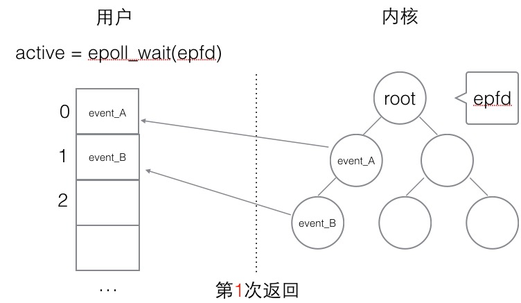
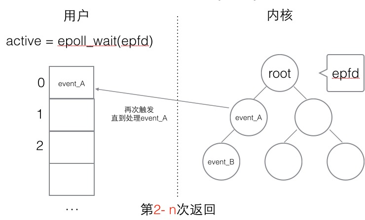

水平触发的主要特点是，如果用户在监听`epoll`事件，当内核有事件的时候，会拷贝给用户态事件，但是**如果用户只处理了一次，那么剩下没有处理的会在下一次epoll_wait再次返回该事件**。

这样如果用户永远不处理这个事件，就导致每次都会有该事件从内核到用户的拷贝，耗费性能，但是水平触发相对安全，最起码事件不会丢掉，除非用户处理完毕。


##### (2) 边缘触发
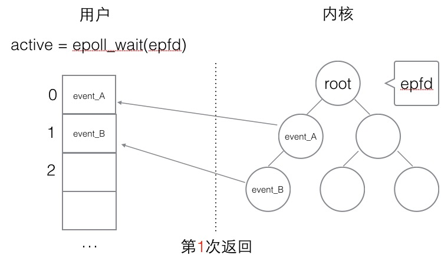

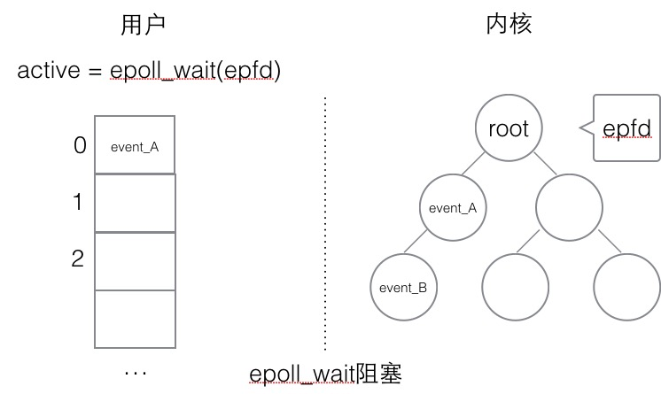


边缘触发，相对跟水平触发相反，当内核有事件到达， 只会通知用户一次，至于用户处理还是不处理，以后将不会再通知。这样减少了拷贝过程，增加了性能，但是相对来说，如果用户马虎忘记处理，将会产生事件丢的情况。


### 六、简单的epoll服务器(C语言)

#### (1) 服务端

```c
#include <stdio.h>
#include <stdlib.h>
#include <ctype.h>
#include <string.h>

#include <unistd.h>
#include <sys/types.h>
#include <sys/socket.h>
#include <arpa/inet.h>

#include <sys/epoll.h>

#define SERVER_PORT (7778)
#define EPOLL_MAX_NUM (2048)
#define BUFFER_MAX_LEN (4096)

char buffer[BUFFER_MAX_LEN];

void str_toupper(char *str)
{
    int i;
    for (i = 0; i < strlen(str); i ++) {
        str[i] = toupper(str[i]);
    }
}

int main(int argc, char **argv)
{
    int listen_fd = 0;
    int client_fd = 0;
    struct sockaddr_in server_addr;
    struct sockaddr_in client_addr;
    socklen_t client_len;

    int epfd = 0;
    struct epoll_event event, *my_events;

    / socket
        listen_fd = socket(AF_INET, SOCK_STREAM, 0);

    // bind
    server_addr.sin_family = AF_INET;
    server_addr.sin_addr.s_addr = htonl(INADDR_ANY);
    server_addr.sin_port = htons(SERVER_PORT);
    bind(listen_fd, (struct sockaddr*)&server_addr, sizeof(server_addr));

    // listen
    listen(listen_fd, 10);

    // epoll create
    epfd = epoll_create(EPOLL_MAX_NUM);
    if (epfd < 0) {
        perror("epoll create");
        goto END;
    }

    // listen_fd -> epoll
    event.events = EPOLLIN;
    event.data.fd = listen_fd;
    if (epoll_ctl(epfd, EPOLL_CTL_ADD, listen_fd, &event) < 0) {
        perror("epoll ctl add listen_fd ");
        goto END;
    }

    my_events = malloc(sizeof(struct epoll_event) * EPOLL_MAX_NUM);


    while (1) {
        // epoll wait
        int active_fds_cnt = epoll_wait(epfd, my_events, EPOLL_MAX_NUM, -1);
        int i = 0;
        for (i = 0; i < active_fds_cnt; i++) {
            // if fd == listen_fd
            if (my_events[i].data.fd == listen_fd) {
                //accept
                client_fd = accept(listen_fd, (struct sockaddr*)&client_addr, &client_len);
                if (client_fd < 0) {
                    perror("accept");
                    continue;
                }

                char ip[20];
                printf("new connection[%s:%d]\n", inet_ntop(AF_INET, &client_addr.sin_addr, ip, sizeof(ip)), ntohs(client_addr.sin_port));

                event.events = EPOLLIN | EPOLLET;
                event.data.fd = client_fd;
                epoll_ctl(epfd, EPOLL_CTL_ADD, client_fd, &event);
            }
            else if (my_events[i].events & EPOLLIN) {
                printf("EPOLLIN\n");
                client_fd = my_events[i].data.fd;

                // do read

                buffer[0] = '\0';
                int n = read(client_fd, buffer, 5);
                if (n < 0) {
                    perror("read");
                    continue;
                }
                else if (n == 0) {
                    epoll_ctl(epfd, EPOLL_CTL_DEL, client_fd, &event);
                    close(client_fd);
                }
                else {
                    printf("[read]: %s\n", buffer);
                    buffer[n] = '\0';
#if 1
                    str_toupper(buffer);
                    write(client_fd, buffer, strlen(buffer));
                    printf("[write]: %s\n", buffer);
                    memset(buffer, 0, BUFFER_MAX_LEN);
#endif

                    /*
                       event.events = EPOLLOUT;
                       event.data.fd = client_fd;
                       epoll_ctl(epfd, EPOLL_CTL_MOD, client_fd, &event);
                       */
                }
            }
            else if (my_events[i].events & EPOLLOUT) {
                printf("EPOLLOUT\n");
                /*
                   client_fd = my_events[i].data.fd;
                   str_toupper(buffer);
                   write(client_fd, buffer, strlen(buffer));
                   printf("[write]: %s\n", buffer);
                   memset(buffer, 0, BUFFER_MAX_LEN);

                   event.events = EPOLLIN;
                   event.data.fd = client_fd;
                   epoll_ctl(epfd, EPOLL_CTL_MOD, client_fd, &event);
                   */
            }
        }
    }

END:
    close(epfd);
    close(listen_fd);
    return 0;
}
```


#### (2) 客户端

```c
#include <stdio.h>
#include <stdlib.h>
#include <string.h>
#include <strings.h>

#include <sys/types.h>
#include <sys/socket.h>
#include <arpa/inet.h>
#include <unistd.h>
#include <fcntl.h>

#define MAX_LINE (1024)
#define SERVER_PORT (7778)

void setnoblocking(int fd)
{
    int opts = 0;
    opts = fcntl(fd, F_GETFL);
    opts = opts | O_NONBLOCK;
    fcntl(fd, F_SETFL);
}

int main(int argc, char **argv)
{
    int sockfd;
    char recvline[MAX_LINE + 1] = {0};

    struct sockaddr_in server_addr;

    if (argc != 2) {
        fprintf(stderr, "usage ./client <SERVER_IP>\n");
        exit(0);
    }


    // 创建socket
    if ( (sockfd = socket(AF_INET, SOCK_STREAM, 0)) < 0) {
        fprintf(stderr, "socket error");
        exit(0);
    }


    // server addr 赋值
    bzero(&server_addr, sizeof(server_addr));
    server_addr.sin_family = AF_INET;
    server_addr.sin_port = htons(SERVER_PORT);

    if (inet_pton(AF_INET, argv[1], &server_addr.sin_addr) <= 0) {
        fprintf(stderr, "inet_pton error for %s", argv[1]);
        exit(0);
    }


    // 链接服务端
    if (connect(sockfd, (struct sockaddr*) &server_addr, sizeof(server_addr)) < 0) {
        perror("connect");
        fprintf(stderr, "connect error\n");
        exit(0);
    }

    setnoblocking(sockfd);

    char input[100];
    int n = 0;
    int count = 0;


    // 不断的从标准输入字符串
    while (fgets(input, 100, stdin) != NULL)
    {
        printf("[send] %s\n", input);
        n = 0;
        // 把输入的字符串发送 到 服务器中去
        n = send(sockfd, input, strlen(input), 0);
        if (n < 0) {
            perror("send");
        }

        n = 0;
        count = 0;


        // 读取 服务器返回的数据
        while (1)
        {
            n = read(sockfd, recvline + count, MAX_LINE);
            if (n == MAX_LINE)
            {
                count += n;
                continue;
            }
            else if (n < 0){
                perror("recv");
                break;
            }
            else {
                count += n;
                recvline[count] = '\0';
                printf("[recv] %s\n", recvline);
                break;
            }
        }
    }

    return 0;
}
```


