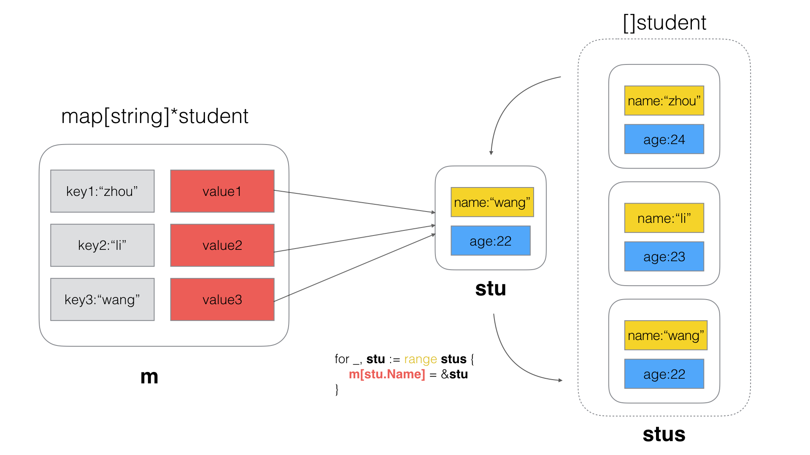
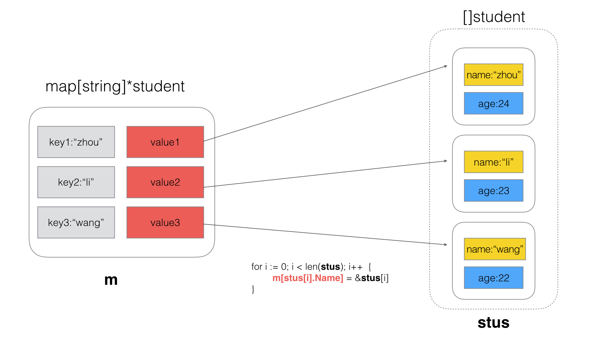

[TOC]

## 三、Map

### (1) Map的Value赋值

> 下面代码编译会出现什么结果？

> test7.go

```go
package main

import "fmt"

type Student struct {
	Name string
}

var list map[string]Student

func main() {

	list = make(map[string]Student)

	student := Student{"Aceld"}

	list["student"] = student
	list["student"].Name = "LDB"

	fmt.Println(list["student"])
}
```

**结果**

编译失败，`./test7.go:18:23: cannot assign to struct field list["student"].Name in map`

**分析**

`map[string]Student` 的value是一个Student结构值，所以当`list["student"] = student`,是一个值拷贝过程。而`list["student"]`则是一个值引用。那么值引用的特点是`只读`。所以对`list["student"].Name = "LDB"`的修改是不允许的。

**方法一：**

```go
package main

import "fmt"

type Student struct {
	Name string
}

var list map[string]Student

func main() {

	list = make(map[string]Student)

	student := Student{"Aceld"}

	list["student"] = student
	//list["student"].Name = "LDB"

    /*
        方法1:
    */
    tmpStudent := list["student"]
    tmpStudent.Name = "LDB"
    list["student"] = tmpStudent

	fmt.Println(list["student"])
}

```

其中

```go
    /*
        方法1:
    */
    tmpStudent := list["student"]
    tmpStudent.Name = "LDB"
    list["student"] = tmpStudent
```

是先做一次值拷贝，做出一个`tmpStudent副本`,然后修改该副本，然后再次发生一次值拷贝复制回去，`list["student"] = tmpStudent`,但是这种会在整体过程中发生2次结构体值拷贝，性能很差。


**方法二**：

```go
package main

import "fmt"

type Student struct {
	Name string
}

var list map[string]*Student

func main() {

	list = make(map[string]*Student)

	student := Student{"Aceld"}

	list["student"] = &student
	list["student"].Name = "LDB"

	fmt.Println(list["student"])
}

```

我们将map的类型的value由Student值，改成Student指针。

```go
var list map[string]*Student
```

这样，我们实际上每次修改的都是指针所指向的Student空间，指针本身是常指针，不能修改，`只读`属性，但是指向的Student是可以随便修改的，而且这里并不需要值拷贝。只是一个指针的赋值。


### (2) map的遍历赋值

---

> 以下代码有什么问题，说明原因

> test8.go

```go
package main

import (
    "fmt"
)

type student struct {
    Name string
    Age  int
}

func main() {
    //定义map
    m := make(map[string]*student)

    //定义student数组
    stus := []student{
        {Name: "zhou", Age: 24},
        {Name: "li", Age: 23},
        {Name: "wang", Age: 22},
    }

    //将数组依次添加到map中
    for _, stu := range stus {
        m[stu.Name] = &stu
    }

    //打印map
    for k,v := range m {
        fmt.Println(k ,"=>", v.Name)
    }
}
```

**结果**

遍历结果出现错误，输出结果为

```bash
zhou => wang
li => wang
wang => wang
```

map中的3个key均指向数组中最后一个结构体。

**分析**

foreach中，stu是结构体的一个拷贝副本，所以`m[stu.Name]=&stu`实际上一致指向同一个指针， 最终该指针的值为遍历的最后一个`struct的值拷贝`。 




**正确写法**

```go
package main

import (
    "fmt"
)

type student struct {
    Name string
    Age  int
}

func main() {
    //定义map
    m := make(map[string]*student)

    //定义student数组
    stus := []student{
        {Name: "zhou", Age: 24},
        {Name: "li", Age: 23},
        {Name: "wang", Age: 22},
    }

    // 遍历结构体数组，依次赋值给map
    for i := 0; i < len(stus); i++  {
        m[stus[i].Name] = &stus[i]
    }

    //打印map
    for k,v := range m {
        fmt.Println(k ,"=>", v.Name)
    }
}
```


**运行结果**

```bash
zhou => zhou
li => li
wang => wang
```


