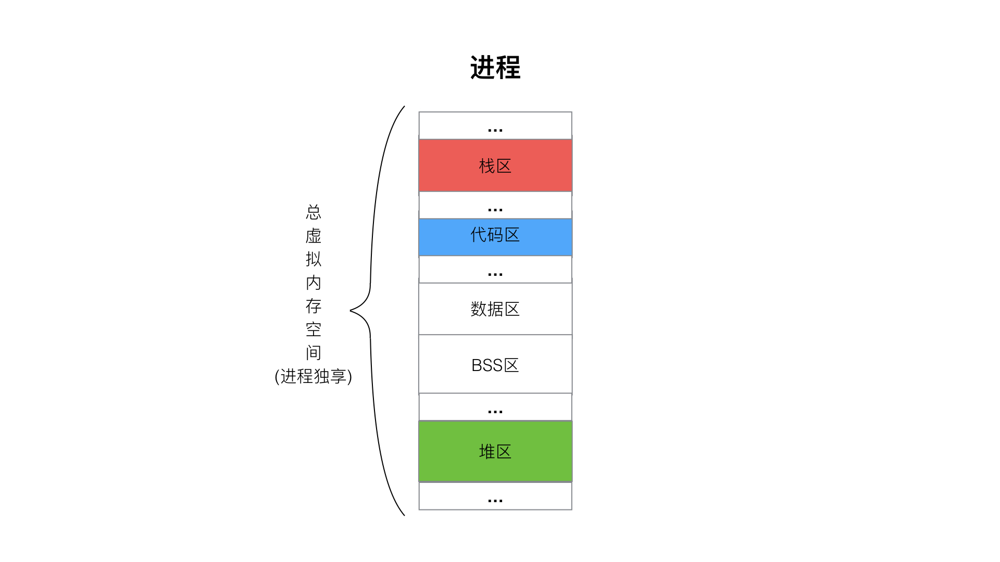
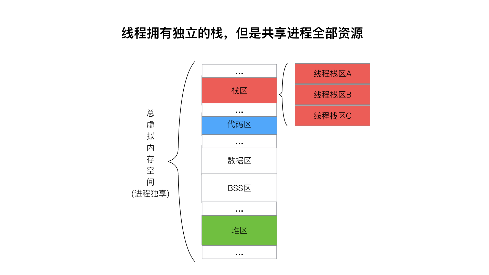
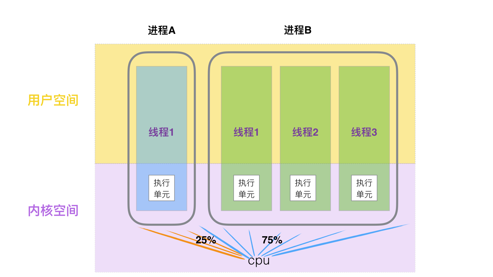
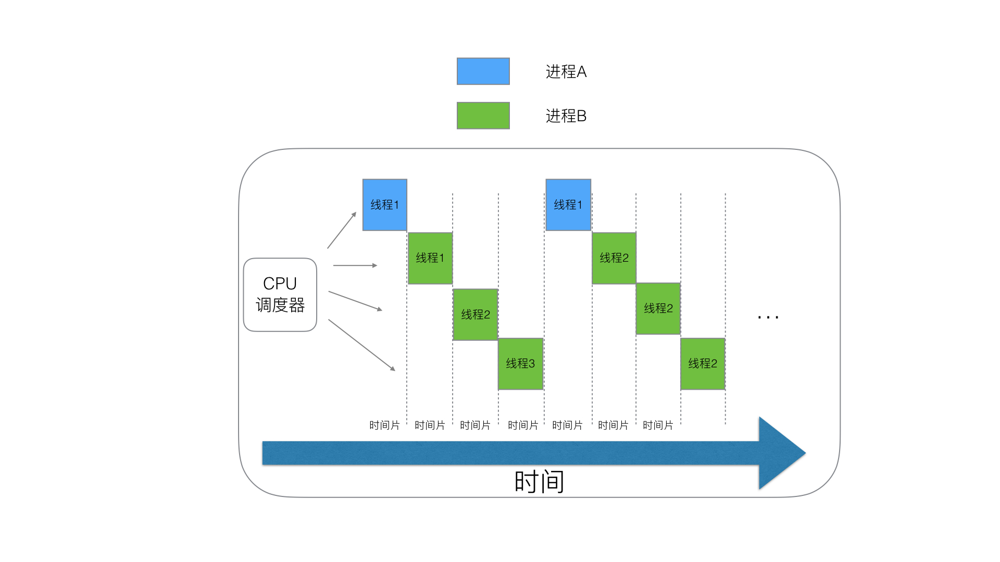
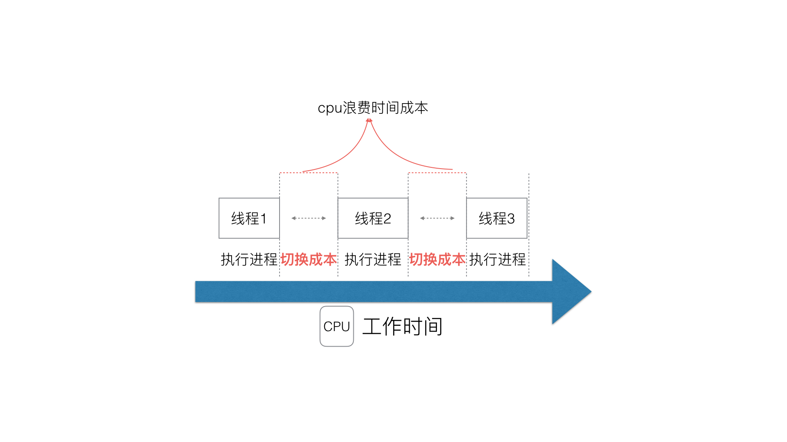
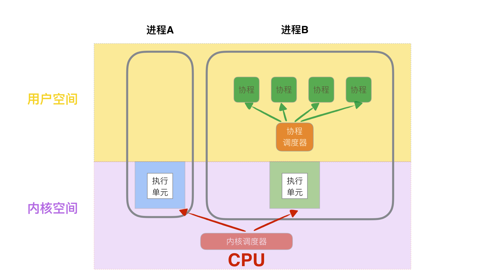

[TOC]

## 3、对于操作系统而言进程、线程以及Goroutine协程的区别


进程、线程、协程实际上都是为并发而生。

但是他们的各自的模样是完全不一致的，下面我们来分析一下他们各自的特点和关系。


> 本文不重点介绍什么是进程和线程，而是提炼进程、线程、协程干货。且是基于Linux下的进程、线程解释

### 一、进程内存

进程，可执行程序运行中形成一个独立的内存体，这个内存体**有自己独立的地址空间(Linux会给每个进程分配一个虚拟内存空间32位操作系统为4G, 64位为很多T)，有自己的堆**，上级挂靠单位是操作系统。**操作系统会以进程为单位，分配系统资源（CPU时间片、内存等资源），进程是资源分配的最小单位**。



### 二、线程内存

**线程，有时被称为轻量级进程(Lightweight Process，LWP），是操作系统调度（CPU调度）执行的最小单位**。 



多个线程共同“寄生”在一个进程上，除了拥有各自的栈空间，其他的内存空间都是一起共享。所以由于这个特性，使得线程之间的内存关联性很大，互相通信就很简单(堆区、全局区等数据都共享，需要加锁机制即可完成同步通信)，但是同时也让线程之间生命体联系较大，比如一个线程出问题，到底进程问题，也就导致了其他线程问题。


### 三、执行单元

对于Linux来讲，不区分进程还是线程，他们都是一个单独的执行单位，CPU一视同仁，均分配时间片。





所以，如果一个进程想更大程度的与其他进程抢占CPU的资源，那么多开线程是一个好的办法。

如上图，进程A没有开线程，那么默认就是`1个线程`，对于内核来讲，它只有1个`执行单元`,进程B开了`3个线程`，那么在内核中，该进程就占有3个`执行单元`。CPU的视野是只能看见内核的，它不知晓谁是进程和谁是线程，谁和谁是一家人。时间片轮询平均调度分配。那么进程B拥有的3个单元就有了资源供给的优势。


### 四、切换问题与协程


我们通过上述的描述，可以知道，线程越多，进程利用(或者)抢占的cpu资源就越高。


那么是不是线程可以无限制的多呢？

答案当然不是的，我们知道，当我们cpu在内核态切换一个`执行单元`的时候，会有一个时间成本和性能开销


其中性能开销至少会有两个开销

* 切换内核栈

* 切换硬件上下文


> 这两个切换，我们没必要太深入研究，可以理解为他所带来的后果和影响是

> ---

* 保存寄存器中的内容

  将之前执行流程的状态保存。

* CPU高速缓存失效

  页表查找是一个很慢的过程，因此通常使用Cache来缓存常用的地址映射，这样可以加速页表查找，这个cache就是TLB.当进程切换后页表也要进行切换，页表切换后TLB就失效了，cache失效导致命中率降低，那么虚拟地址转换为物理地址就会变慢，**表现出来的就是程序运行会变慢**。

> ---


综上，我们不能够大量的开辟，因为`线程执行流程`越多，cpu在切换的时间成本越大。很多编程语言就想了办法，既然我们不能左右和优化cpu切换线程的开销，那么，我们能否让cpu内核态不切换`执行单元`， 而是在用户态切换执行流程呢？


很显然，我们是没权限修改操作系统内核机制的，那么只能在用户态再来一个`伪执行单元`,那么就是`协程`了。




### 五、协程的切换成本

协程切换比线程切换快主要有两点：

（1）协程切换**完全在用户空间进行**。线程切换涉及**特权模式切换，需要在内核空间完成**；

（2）协程切换相比线程切换**做的事情更少**，线程需要有内核和用户态的切换,系统调用过程。


#### 协程切换成本：

协程切换非常简单，就是把**当前协程的 CPU 寄存器状态保存起来，然后将需要切换进来的协程的 CPU 寄存器状态加载到 CPU 寄存器上**就 ok 了。而且**完全在用户态进行**，一般来说一次协程上下文切换最多就是**几十ns** 这个量级。


#### 线程切换成本：

系统内核调度的对象是线程，因为线程是调度的基本单元（进程是资源拥有的基本单元，进程的切换需要做的事情更多，这里占时不讨论进程切换），而**线程的调度只有拥有最高权限的内核空间才可以完成**，所以线程的切换涉及到**用户空间和内核空间的切换**，也就是特权模式切换，然后需要操作系统调度模块完成**线程调度（task_struct）**，而且除了和协程相同基本的 CPU 上下文，还有线程私有的栈和寄存器等，说白了就是上下文比协程多一些，其实简单比较下 task_strcut 和 任何一个协程库的 coroutine 的 struct 结构体大小就能明显区分出来。而且特权模式切换的开销确实不小，随便搜一组测试数据 [3]，随便算算都比协程切换开销大很多。


**进程占用多少内存**

4g


**线程占用多少内存**

线程跟不同的操作系统版本有有差异

```bash
$ulimit -s
8192
```

单位`kb`


但线程基本都是维持Mb的量级单位，一般是4~64Mb不等， 多数维持约10M上下


**协程占用多少内存**

测试环境

```bash
$ more /proc/cpuinfo | grep "model name"
model name	: Intel(R) Core(TM) i7-5775R CPU @ 3.30GHz
model name	: Intel(R) Core(TM) i7-5775R CPU @ 3.30GHz

(2个CPU )

$ grep MemTotal /proc/meminfo
MemTotal:        2017516 kB

(2G内存)

$ getconf LONG_BIT
64

(64位操作系统)

$ uname -a
Linux ubuntu 4.15.0-91-generic #92-Ubuntu SMP Fri Feb 28 11:09:48 UTC 2020 x86_64 x86_64 x86_64 GNU/Linux


```


测试程序

```go
package main

import (

    "time"
)

func main() {

    for i := 0; i < 200000; i++ {

        go func() {

            time.Sleep(5 * time.Second)

        }()

    }

    time.Sleep(10 * time.Second)
}

```


程序运行前

```bash
top - 00:16:24 up  7:08,  1 user,  load average: 0.08, 0.03, 0.01
任务: 288 total,   1 running, 218 sleeping,   0 stopped,   0 zombie
%Cpu0  :  0.0 us,  0.0 sy,  0.0 ni,100.0 id,  0.0 wa,  0.0 hi,  0.0 si,  0.0 st
%Cpu1  :  0.3 us,  0.3 sy,  0.0 ni, 99.3 id,  0.0 wa,  0.0 hi,  0.0 si,  0.0 st
KiB Mem :  2017516 total,   593836 free,  1163524 used,   260156 buff/cache
KiB Swap:   969960 total,   574184 free,   395776 used.   679520 avail Mem 
```

free的mem为1163524，


程序运行中

```bash
top - 00:17:12 up  7:09,  1 user,  load average: 0.04, 0.02, 0.00
任务: 290 total,   1 running, 220 sleeping,   0 stopped,   0 zombie
%Cpu0  :  4.0 us,  1.0 sy,  0.0 ni, 95.0 id,  0.0 wa,  0.0 hi,  0.0 si,  0.0 st
%Cpu1  :  8.8 us,  1.4 sy,  0.0 ni, 89.9 id,  0.0 wa,  0.0 hi,  0.0 si,  0.0 st
KiB Mem :  2017516 total,    89048 free,  1675844 used,   252624 buff/cache
KiB Swap:   969960 total,   563688 free,   406272 used.   168812 avail Mem 
```

free的mem为1675844，

所以 **20万个** 协程占用了约 **50万KB**, **平均** 一个协程占用约 **2.5KB**


那么，go的协程切换成本如此小，占用也那么小，是否可以无限开辟呢？


