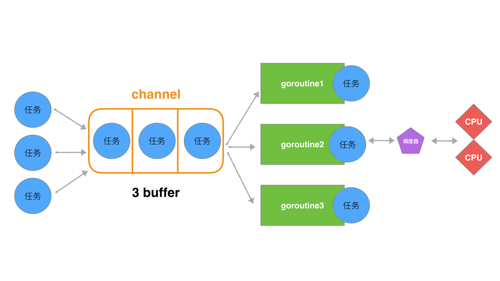
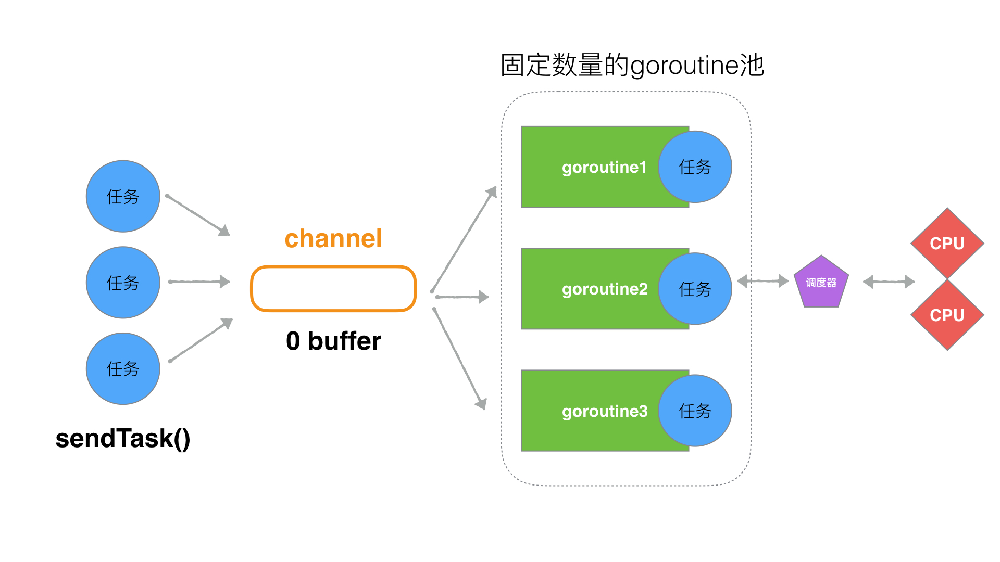

[TOC]

## 4、Go是否可以无限go？ 如何限定数量？


### 一、不控制goroutine数量引发的问题

我们都知道Goroutine具备如下两个特点

* 体积轻量
* 优质的GMP调度

那么goroutine是否可以无限开辟呢，如果做一个服务器或者一些高业务的场景，能否随意的开辟goroutine并且放养不管呢？让他们自生自灭，毕竟有强大的GC和优质的调度算法支撑？

那么我可以先看如下一个问题。


> code1.go

```go
package main

import (
    "fmt"
    "math"
    "runtime"
)

func main() {
    //模拟用户需求业务的数量
    task_cnt := math.MaxInt64

    for i := 0; i < task_cnt; i++ {
        go func(i int) {
            //... do some busi...

            fmt.Println("go func ", i, " goroutine count = ", runtime.NumGoroutine())
        }(i)
    }
}
```

结果


最后被操作系统以kill信号，强制终结该进程。

```bash
signal: killed
```

所以，我们迅速的开辟goroutine(**不控制并发的 goroutine 数量** )会在短时间内占据操作系统的资源(CPU、内存、文件描述符等)。


- CPU 使用率浮动上涨
- Memory 占用不断上涨。
- 主进程崩溃（被杀掉了）


这些资源实际上是所有用户态程序共享的资源，所以大批的goroutine最终引发的灾难不仅仅是自身，还会关联其他运行的程序。

所以在编写逻辑业务的时候，限制goroutine是我们必须要重视的问题。

---

### 二、一些简单方法控制goroutines数量

#### 方法一：只是用有buffer的channel来限制


> code2.go

```go
package main

import (
    "fmt"
    "math"
    "runtime"
)

func busi(ch chan bool, i int) {

    fmt.Println("go func ", i, " goroutine count = ", runtime.NumGoroutine())
    <-ch
}

func main() {
    //模拟用户需求业务的数量
    task_cnt := math.MaxInt64
    //task_cnt := 10

    ch := make(chan bool, 3)

    for i := 0; i < task_cnt; i++ {

        ch <- true

        go busi(ch, i)
    }

}
```


结果

```bash
...
go func  352277  goroutine count =  4
go func  352278  goroutine count =  4
go func  352279  goroutine count =  4
go func  352280  goroutine count =  4
go func  352281  goroutine count =  4
go func  352282  goroutine count =  4
go func  352283  goroutine count =  4
go func  352284  goroutine count =  4
go func  352285  goroutine count =  4
go func  352286  goroutine count =  4
go func  352287  goroutine count =  4
go func  352288  goroutine count =  4
go func  352289  goroutine count =  4
go func  352290  goroutine count =  4
go func  352291  goroutine count =  4
go func  352292  goroutine count =  4
go func  352293  goroutine count =  4
go func  352294  goroutine count =  4
go func  352295  goroutine count =  4
go func  352296  goroutine count =  4
go func  352297  goroutine count =  4
go func  352298  goroutine count =  4
go func  352299  goroutine count =  4
go func  352300  goroutine count =  4
go func  352301  goroutine count =  4
go func  352302  goroutine count =  4
...
```


从结果看，程序并没有出现崩溃，而是按部就班的顺序执行，并且go的数量控制在了3，(4的原因是因为还有一个main goroutine)那么从数字上看，是不是在跑的goroutines有几十万个呢？



这里我们用了，buffer为3的channel, 在写的过程中，实际上是限制了速度。限制的是

```go
 for i := 0; i < go_cnt; i++ { //循环速度

        ch <- true

        go busi(ch, i)
}
```

`for`循环的速度，因为这个速度决定了go的创建速度，而go的结束速度取决于 `busi()`函数的执行速度。 这样实际上，我们就能够保证了，同一时间内运行的goroutine的数量与buffer的数量一致。从而达到了限定效果。


但是这段代码有一个小问题，就是如果我们把go_cnt的数量变的小一些，会出现打出的结果不正确。

```go
package main

import (
    "fmt"
    //"math"
    "runtime"
)

func busi(ch chan bool, i int) {

    fmt.Println("go func ", i, " goroutine count = ", runtime.NumGoroutine())
    <-ch
}

func main() {
    //模拟用户需求业务的数量
    //task_cnt := math.MaxInt64
    task_cnt := 10

    ch := make(chan bool, 3)

    for i := 0; i < task_cnt; i++ {

        ch <- true

        go busi(ch, i)
    }

}
```

结果

```bash
go func  2  goroutine count =  4
go func  3  goroutine count =  4
go func  4  goroutine count =  4
go func  5  goroutine count =  4
go func  6  goroutine count =  4
go func  1  goroutine count =  4
go func  8  goroutine count =  4
```

是因为`main`将全部的go开辟完之后，就立刻退出进程了。所以想全部go都执行，需要在main的最后进行阻塞操作。

#### 方法二：只使用sync同步机制

> code3.go

```go
import (
    "fmt"
    "math"
    "sync"
    "runtime"
)

var wg = sync.WaitGroup{}

func busi(i int) {

    fmt.Println("go func ", i, " goroutine count = ", runtime.NumGoroutine())
    wg.Done()
}

func main() {
    //模拟用户需求业务的数量
    task_cnt := math.MaxInt64


    for i := 0; i < task_cnt; i++ {
		wg.Add(1)
        go busi(i)
    }

	  wg.Wait()
}
```

很明显，单纯的使用`sync`依然达不到控制goroutine的数量，所以最终结果依然是崩溃。

结果

```bash
...
go func  7562  goroutine count =  7582
go func  24819  goroutine count =  17985
go func  7685  goroutine count =  7582
go func  24701  goroutine count =  17984
go func  7563  goroutine count =  7582
go func  24821  goroutine count =  17983
go func  24822  goroutine count =  17983
go func  7686  goroutine count =  7582
go func  24703  goroutine count =  17982
go func  7564  goroutine count =  7582
go func  24824  goroutine count =  17981
go func  7687  goroutine count =  7582
go func  24705  goroutine count =  17980
go func  24706  goroutine count =  17980
go func  24707  goroutine count =  17979
go func  7688  goroutine count =  7582
go func  24826  goroutine count =  17978
go func  7566  goroutine count =  7582
go func  24709  goroutine count =  17977
go func  7689  goroutine count =  7582
go func  24828  goroutine count =  17976
go func  24829  goroutine count =  17976
go func  7567  goroutine count =  7582
go func  24711  goroutine count =  17975
//操作系统停止响应
```


#### 方法三：channel与sync同步组合方式

> code4.go

```go
package main

import (
    "fmt"
    "math"
    "sync"
    "runtime"
)

var wg = sync.WaitGroup{}

func busi(ch chan bool, i int) {

    fmt.Println("go func ", i, " goroutine count = ", runtime.NumGoroutine())

    <-ch

    wg.Done()
}

func main() {
    //模拟用户需求go业务的数量
    task_cnt := math.MaxInt64

    ch := make(chan bool, 3)

    for i := 0; i < task_cnt; i++ {
		wg.Add(1)

        ch <- true

        go busi(ch, i)
    }

	  wg.Wait()
}
```


结果

```bash
//...
go func  228851  goroutine count =  4
go func  228852  goroutine count =  4
go func  228853  goroutine count =  4
go func  228854  goroutine count =  4
go func  228855  goroutine count =  4
go func  228856  goroutine count =  4
go func  228857  goroutine count =  4
go func  228858  goroutine count =  4
go func  228859  goroutine count =  4
go func  228860  goroutine count =  4
go func  228861  goroutine count =  4
go func  228862  goroutine count =  4
go func  228863  goroutine count =  4
go func  228864  goroutine count =  4
go func  228865  goroutine count =  4
go func  228866  goroutine count =  4
go func  228867  goroutine count =  4
//...
```


这样我们程序就不会再造成资源爆炸而崩溃。而且运行go的数量控制住了在buffer为3的这个范围内。


#### 方法四：利用无缓冲channel与任务发送/执行分离方式

> code5.go

```go
package main

import (
    "fmt"
    "math"
    "sync"
    "runtime"
)

var wg = sync.WaitGroup{}

func busi(ch chan int) {

    for t := range ch {
        fmt.Println("go task = ", t, ", goroutine count = ", runtime.NumGoroutine())
        wg.Done()
    }
}

func sendTask(task int, ch chan int) {
    wg.Add(1)
    ch <- task
}

func main() {

    ch := make(chan int)   //无buffer channel

    goCnt := 3              //启动goroutine的数量
    for i := 0; i < goCnt; i++ {
        //启动go
        go busi(ch)
    }

    taskCnt := math.MaxInt64 //模拟用户需求业务的数量
    for t := 0; t < taskCnt; t++ {
        //发送任务
        sendTask(t, ch)
    }

	  wg.Wait()
}
```

结构

```bash
//...
go task =  130069 , goroutine count =  4
go task =  130070 , goroutine count =  4
go task =  130071 , goroutine count =  4
go task =  130072 , goroutine count =  4
go task =  130073 , goroutine count =  4
go task =  130074 , goroutine count =  4
go task =  130075 , goroutine count =  4
go task =  130076 , goroutine count =  4
go task =  130077 , goroutine count =  4
go task =  130078 , goroutine count =  4
go task =  130079 , goroutine count =  4
go task =  130080 , goroutine count =  4
go task =  130081 , goroutine count =  4
go task =  130082 , goroutine count =  4
go task =  130083 , goroutine count =  4
go task =  130084 , goroutine count =  4
go task =  130085 , goroutine count =  4
go task =  130086 , goroutine count =  4
go task =  130087 , goroutine count =  4
go task =  130088 , goroutine count =  4
go task =  130089 , goroutine count =  4
go task =  130090 , goroutine count =  4
go task =  130091 , goroutine count =  4
go task =  130092 , goroutine count =  4
go task =  130093 , goroutine count =  4
...
```

执行流程大致如下，这里实际上是将任务的发送和执行做了业务上的分离。使得消息出去，输入SendTask的频率可设置、执行Goroutine的数量也可设置。也就是既控制输入(生产)，又控制输出(消费)。使得可控更加灵活。这也是很多Go框架的Worker工作池的最初设计思想理念。



---

以上便是目前有关限定goroutine基础设计思路。

参考：

http://team.jiunile.com/blog/2019/09/go-control-goroutine-number.html

https://www.joyk.com/dig/detail/1547976674512705


