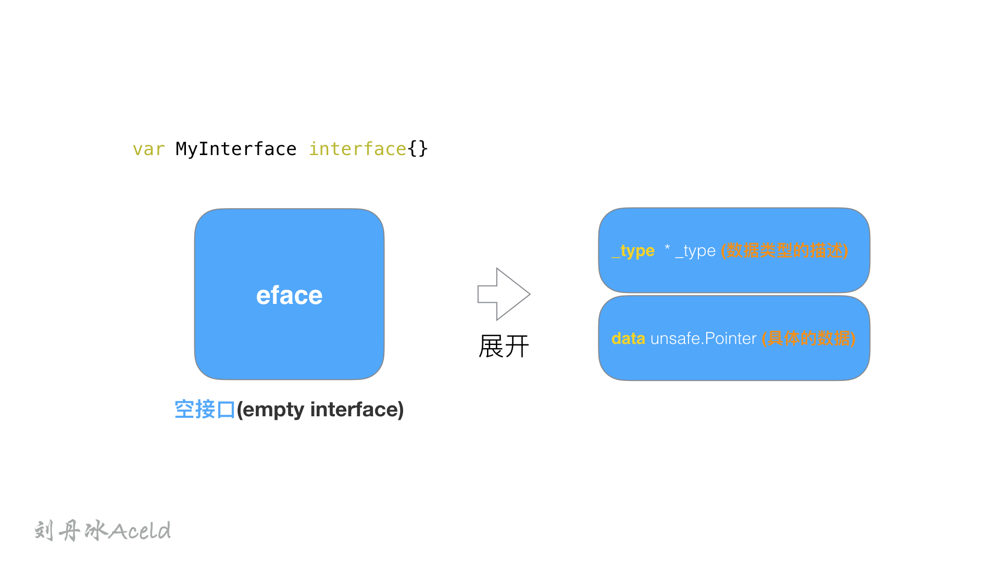
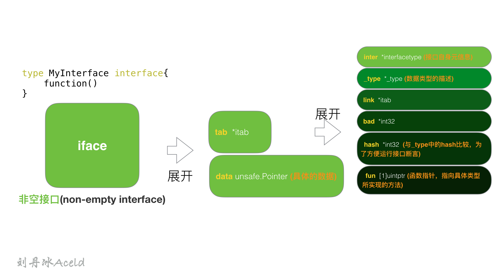
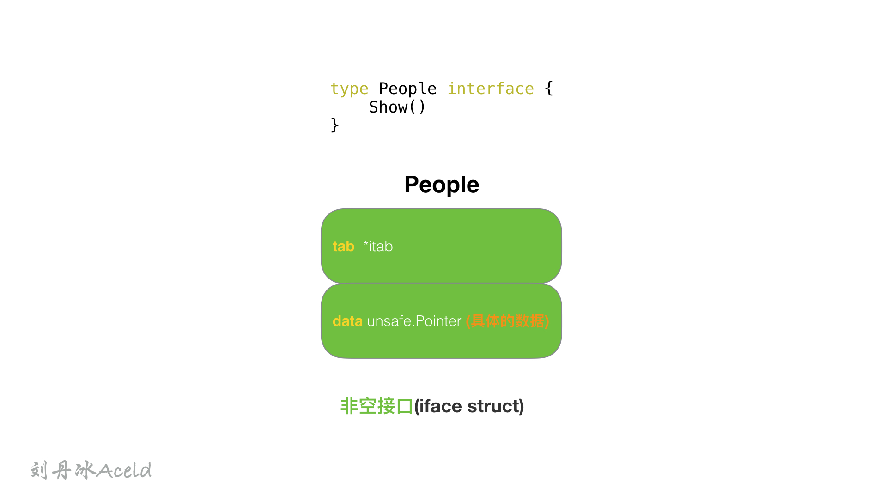
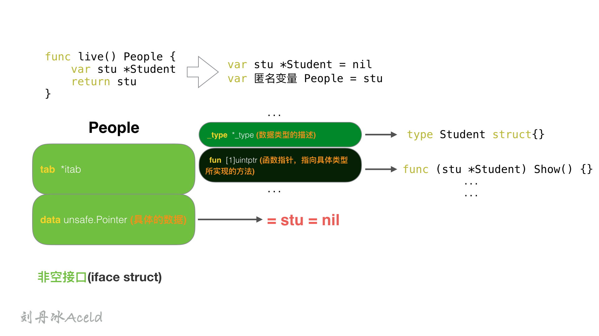
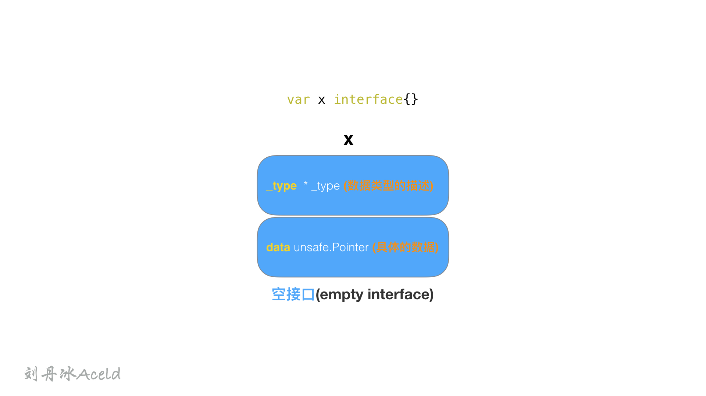
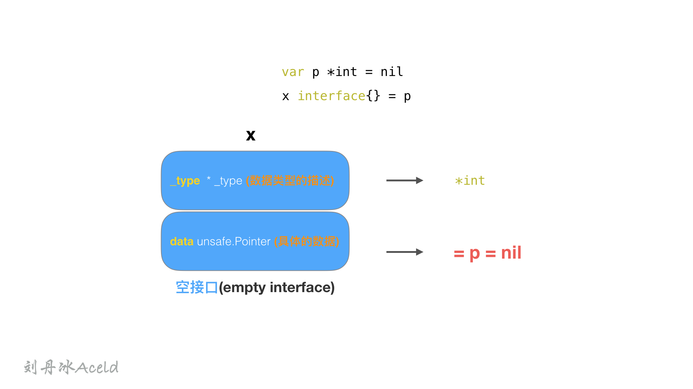

[TOC]

## 四、interface

### (1) interface的赋值问题

> 以下代码能编译过去吗？为什么？

> test12.go

```go
package main

import (
	"fmt"
)

type People interface {
	Speak(string) string
}

type Student struct{}

func (stu *Student) Speak(think string) (talk string) {
	if think == "love" {
		talk = "You are a good boy"
	} else {
		talk = "hi"
	}
	return
}

func main() {
	var peo People = Student{}
	think := "love"
	fmt.Println(peo.Speak(think))
}
```

继承与多态的特点

在golang中对多态的特点体现从语法上并不是很明显。

我们知道发生多态的几个要素：

1、有interface接口，并且有接口定义的方法。

2、有子类去重写interface的接口。

3、有父类指针指向子类的具体对象

那么，满足上述3个条件，就可以产生多态效果，就是，父类指针可以调用子类的具体方法。

所以上述代码报错的地方在`var peo People = Student{}`这条语句， `Student{}`已经重写了父类`People{}`中的`Speak(string) string`方法，那么只需要用父类指针指向子类对象即可。

所以应该改成`var peo People = &Student{}` 即可编译通过。（People为interface类型，就是指针类型）


### (2) interface的内部构造(非空接口iface情况)

>  以下代码打印出来什么内容，说出为什么。

> test14.go

```go
package main

import (
	"fmt"
)

type People interface {
	Show()
}

type Student struct{}

func (stu *Student) Show() {

}

func live() People {
	var stu *Student
	return stu
}

func main() {
	if live() == nil {
		fmt.Println("AAAAAAA")
	} else {
		fmt.Println("BBBBBBB")
	}
}
```

**结果**

```bash
BBBBBBB
```

**分析：**

我们需要了解`interface`的内部结构，才能理解这个题目的含义。

interface在使用的过程中，共有两种表现形式

一种为**空接口(empty interface)**，定义如下：

```go
var MyInterface interface{}
```


另一种为**非空接口(non-empty interface)**,   定义如下：

```go
type MyInterface interface {
		function()
}
```


这两种interface类型分别用两种`struct`表示，空接口为`eface`, 非空接口为`iface`.


---


#### **空接口eface**

空接口eface结构，由两个属性构成，一个是类型信息_type，一个是数据信息。其数据结构声明如下：

```go
type eface struct {      //空接口
    _type *_type         //类型信息
    data  unsafe.Pointer //指向数据的指针(go语言中特殊的指针类型unsafe.Pointer类似于c语言中的void*)
}
```

**_type属性**：是GO语言中所有类型的公共描述，Go语言几乎所有的数据结构都可以抽象成 _type，是所有类型的公共描述，**type负责决定data应该如何解释和操作，**type的结构代码如下:

```go
type _type struct {
    size       uintptr  //类型大小
    ptrdata    uintptr  //前缀持有所有指针的内存大小
    hash       uint32   //数据hash值
    tflag      tflag
    align      uint8    //对齐
    fieldalign uint8    //嵌入结构体时的对齐
    kind       uint8    //kind 有些枚举值kind等于0是无效的
    alg        *typeAlg //函数指针数组，类型实现的所有方法
    gcdata    *byte
    str       nameOff
    ptrToThis typeOff
}
```

**data属性:** 表示指向具体的实例数据的指针，他是一个`unsafe.Pointer`类型，相当于一个C的万能指针`void*`。




---

#### 非空接口iface

iface 表示 non-empty interface 的数据结构，非空接口初始化的过程就是初始化一个iface类型的结构，其中`data`的作用同`eface`的相同，这里不再多加描述。

```go
type iface struct {
  tab  *itab
  data unsafe.Pointer
}
```

iface结构中最重要的是itab结构（结构如下），每一个 `itab` 都占 32 字节的空间。itab可以理解为`pair<interface type, concrete type>` 。itab里面包含了interface的一些关键信息，比如method的具体实现。

```go
type itab struct {
  inter  *interfacetype   // 接口自身的元信息
  _type  *_type           // 具体类型的元信息
  link   *itab
  bad    int32
  hash   int32            // _type里也有一个同样的hash，此处多放一个是为了方便运行接口断言
  fun    [1]uintptr       // 函数指针，指向具体类型所实现的方法
}
```

其中值得注意的字段，个人理解如下：

1. `interface type`包含了一些关于interface本身的信息，比如`package path`，包含的`method`。这里的interfacetype是定义interface的一种抽象表示。
2. `type`表示具体化的类型，与eface的 *type类型相同。*
3. `hash`字段其实是对`_type.hash`的拷贝，它会在interface的实例化时，用于快速判断目标类型和接口中的类型是否一致。另，Go的interface的Duck-typing机制也是依赖这个字段来实现。
4. `fun`字段其实是一个动态大小的数组，虽然声明时是固定大小为1，但在使用时会直接通过fun指针获取其中的数据，并且不会检查数组的边界，所以该数组中保存的元素数量是不确定的。



---

所以，People拥有一个Show方法的，属于非空接口，People的内部定义应该是一个`iface`结构体

```go
type People interface {
    Show()  
}  
```





```go
func live() People {
    var stu *Student
    return stu      
}     
```

stu是一个指向nil的空指针，但是最后`return stu` 会触发`匿名变量 People = stu`值拷贝动作，所以最后`live()`放回给上层的是一个`People insterface{}`类型，也就是一个`iface struct{}`类型。 stu为nil，只是`iface`中的data 为nil而已。 但是`iface struct{}`本身并不为nil. 



所以如下判断的结果为`BBBBBBB`：

```go
func main() {   
    if live() == nil {  
        fmt.Println("AAAAAAA")      
    } else {
        fmt.Println("BBBBBBB")
    }
}
```


### (3) interface内部构造(空接口eface情况)

> 下面代码结果为什么？

```go
func Foo(x interface{}) {
	if x == nil {
		fmt.Println("empty interface")
		return
	}
	fmt.Println("non-empty interface")
}
func main() {
	var p *int = nil
	Foo(p)
}
```

**结果**

```bash
non-empty interface
```

**分析**

不难看出，`Foo()`的形参`x interface{}`是一个空接口类型`eface struct{}`。



在执行`Foo(p)`的时候，触发`x interface{} = p`语句，所以此时 x结构如下。


所以 x 结构体本身不为nil，而是data指针指向的p为nil。

---


### (4) inteface{}与*interface{}

>  ABCD中哪一行存在错误？

> test15.go

```go
type S struct {
}

func f(x interface{}) {
}

func g(x *interface{}) {
}

func main() {
	s := S{}
	p := &s
	f(s) //A
	g(s) //B
	f(p) //C
	g(p) //D
}
```

**结果**

```bash
B、D两行错误
B错误为： cannot use s (type S) as type *interface {} in argument to g:
	*interface {} is pointer to interface, not interface
	
D错误为：cannot use p (type *S) as type *interface {} in argument to g:
	*interface {} is pointer to interface, not interface

```

看到这道题需要第一时间想到的是Golang是强类型语言，interface是所有golang类型的父类 函数中`func f(x interface{})`的`interface{}`可以支持传入golang的任何类型，包括指针，但是函数`func g(x *interface{})`只能接受`*interface{}`

