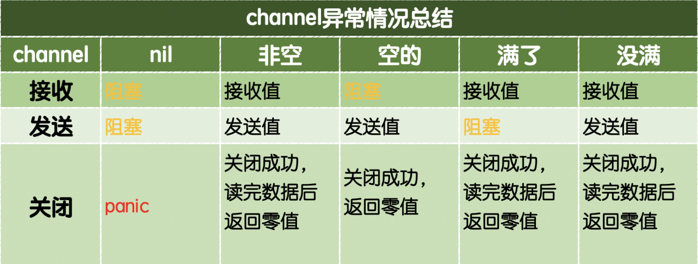

[TOC]

## 五、channel

### (1)Channel读写特性(15字口诀)

首先，我们先复习一下Channel都有哪些特性？

* 给一个 nil channel 发送数据，造成永远阻塞

* 从一个 nil channel 接收数据，造成永远阻塞

* 给一个已经关闭的 channel 发送数据，引起 panic

* 从一个已经关闭的 channel 接收数据，如果缓冲区中为空，则返回 **一个零值 和 false** (ex: `val,ok:= <-ch1`)

* 无缓冲的channel是同步的，而有缓冲的channel是非同步的

以上5个特性是死东西，也可以通过口诀来记忆：“读写**空**阻塞，写**关闭**异常，读**关闭空**零假”。




> 执行下面的代码发生什么？

> test17.go

```go
package main

import (
	"fmt"
	"time"
)

func main() {
	ch := make(chan int, 1000)
	go func() {
		for i := 0; i < 10; i++ {
			ch <- i
		}
	}()
	go func() {
		for {
			a, ok := <-ch
			if !ok {
				fmt.Println("close")
				return
			}
			fmt.Println("a: ", a)
		}
	}()
	close(ch)
	fmt.Println("ok")
	time.Sleep(time.Second * 100)
}
```


15字口诀：“读写**空**阻塞，写**关闭**异常，读**关闭空**零假”，往已经关闭的channel写入数据会panic的。因为main在开辟完两个goroutine之后，立刻关闭了ch， 结果：

```
panic: send on closed channel
```