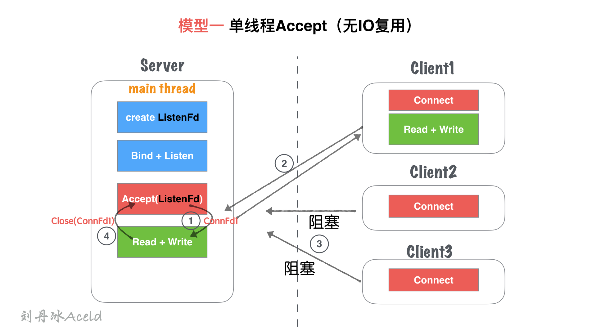
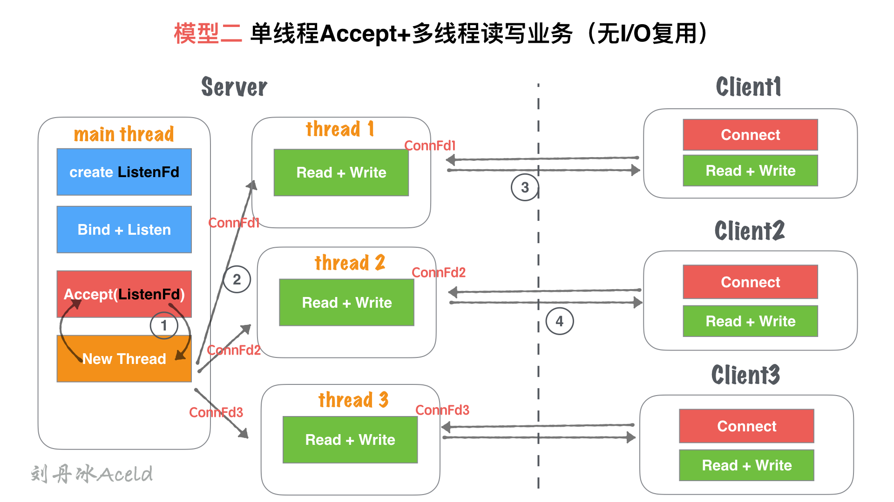
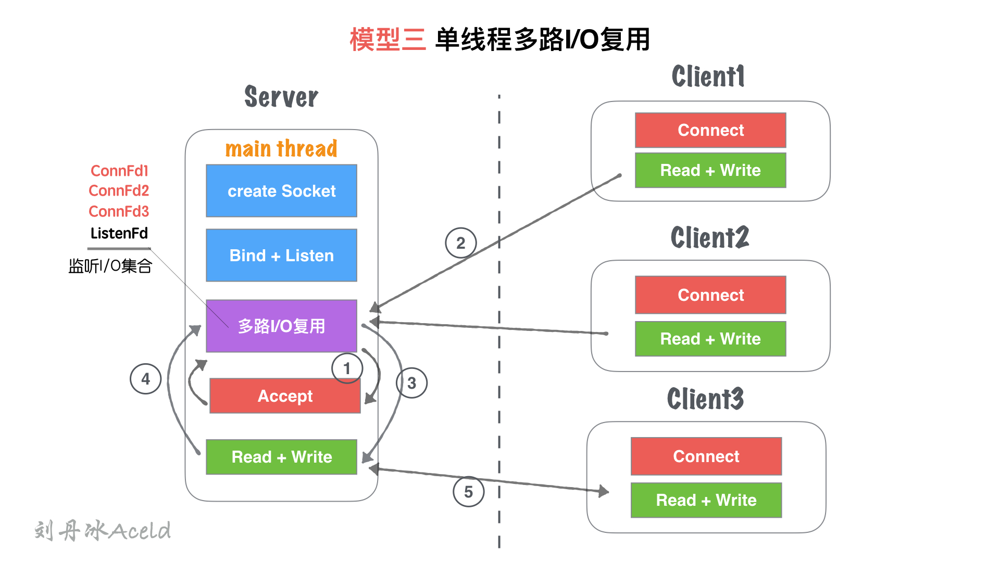
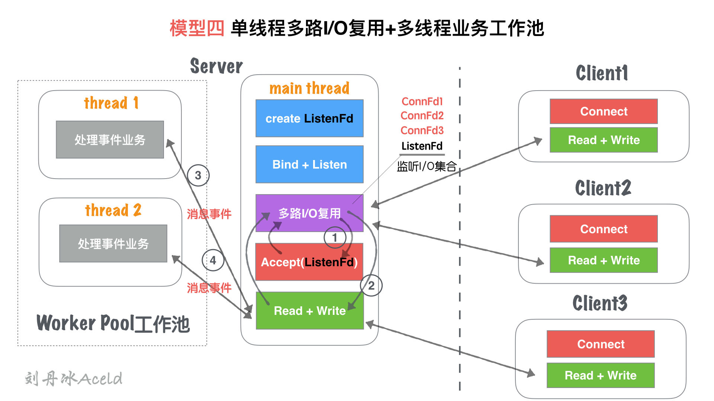
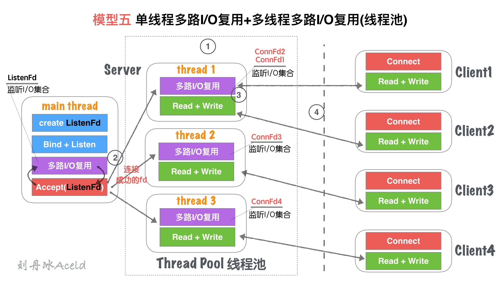
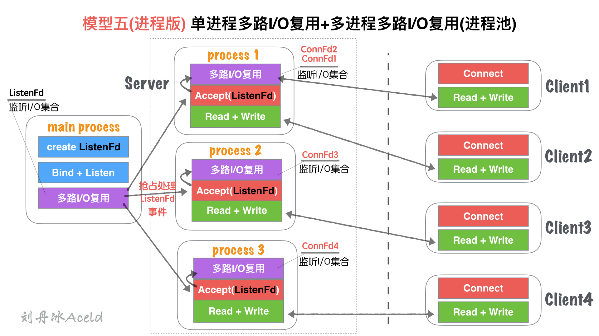
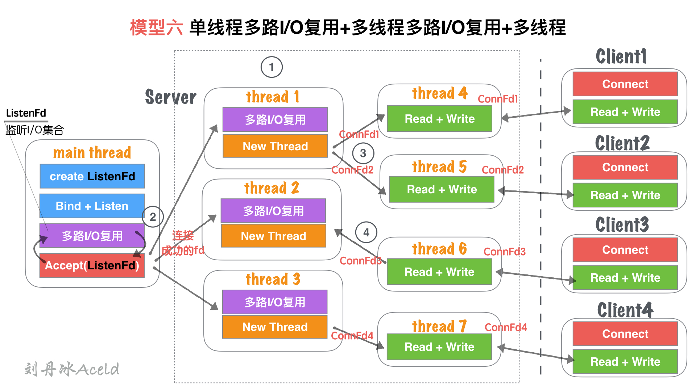

[TOC]

## 5、单点Server的N种并发模型汇总

本文主要介绍常见的Server的并发模型，这些模型与编程语言本身无关，有的编程语言可能在语法上直接透明了模型本质，所以开发者没必要一定要基于模型去编写，只是需要知道和了解并发模型的构成和特点即可。

那么在了解并发模型之前，我们需要两个必备的前置知识：

* socket网络编程
* 多路IO复用机制
* 多线程/多进程等并发编程理论

### 模型一、单线程Accept（无IO复用）

#### (1) 模型结构图

#### (2) 模型分析

① 主线程`main thread`执行阻塞Accept，每次客户端Connect链接过来，`main thread`中accept响应并建立连接

② 创建链接成功，得到`Connfd1`套接字后, 依然在`main thread`串行处理套接字读写，并处理业务。

③ 在②处理业务中，如果有新客户端`Connect`过来，`Server`无响应，直到当前套接字全部业务处理完毕。

④ 当前客户端处理完后，完毕链接，处理下一个客户端请求。

#### (3) 优缺点

**优点**：

* socket编程流程清晰且简单，适合学习使用，了解socket基本编程流程。

**缺点**：

* 该模型并非并发模型，是串行的服务器，同一时刻，监听并响应最大的网络请求量为`1`。 即并发量为`1`。

* 仅适合学习基本socket编程，不适合任何服务器Server构建。

### 模型二、单线程Accept+多线程读写业务（无IO复用）

#### (1) 模型结构图

#### (2) 模型分析

① 主线程`main thread`执行阻塞Accept，每次客户端Connect链接过来，`main thread`中accept响应并建立连接

② 创建链接成功，得到`Connfd1`套接字后，创建一个新线程`thread1`用来处理客户端的读写业务。`main thead`依然回到`Accept`阻塞等待新客户端。

③ `thread1`通过套接字`Connfd1`与客户端进行通信读写。

④ server在②处理业务中，如果有新客户端`Connect`过来，`main thread`中`Accept`依然响应并建立连接，重复②过程。

#### (3) 优缺点

**优点**：

* 基于`模型一：单线程Accept（无IO复用）` 支持了并发的特性。
* 使用灵活，一个客户端对应一个线程单独处理，`server`处理业务内聚程度高，客户端无论如何写，服务端均会有一个线程做资源响应。

**缺点**：

* 随着客户端的数量增多，需要开辟的线程也增加，客户端与server线程数量`1:1`正比关系，一次对于高并发场景，线程数量收到硬件上限瓶颈。
* 对于长链接，客户端一旦无业务读写，只要不关闭，server的对应线程依然需要保持连接(心跳、健康监测等机制)，占用连接资源和线程开销资源浪费。
* 仅适合客户端数量不大，并且数量可控的场景使用。

仅适合学习基本socket编程，不适合任何服务器Server构建。

### 模型三、单线程多路IO复用

#### (1) 模型结构图

#### (2) 模型分析

① 主线程`main thread`创建`listenFd`之后，采用多路I/O复用机制(如:select、epoll)进行IO状态阻塞监控。有`Client1`客户端`Connect`请求，I/O复用机制检测到`ListenFd`触发读事件，则进行`Accept`建立连接，并将新生成的`connFd1`加入到`监听I/O集合`中。

② `Client1`再次进行正常读写业务请求，`main thread`的`多路I/O复用机制`阻塞返回，会触该套接字的读/写事件等。

③ 对于`Client1`的读写业务，Server依然在`main thread`执行流程提继续执行，此时如果有新的客户端`Connect`链接请求过来，Server将没有即时响应。

④ 等到Server处理完一个连接的`Read+Write`操作，继续回到`多路I/O复用机制`阻塞，其他链接过来重复    ②、③流程。

#### (3) 优缺点

**优点**：

* 单流程解决了可以同时监听多个客户端读写状态的模型，不需要`1:1`与客户端的线程数量关系。
* 多路I/O复用阻塞，非忙询状态，不浪费CPU资源， CPU利用率较高。

**缺点**：

* 虽然可以监听多个客户端的读写状态，但是同一时间内，只能处理一个客户端的读写操作，实际上读写的业务并发为1。
* 多客户端访问Server，业务为串行执行，大量请求会有排队延迟现象，如图中⑤所示，当`Client3`占据`main thread`流程时，`Client1,Client2`流程卡在`IO复用`等待下次监听触发事件。

### 模型四、单线程多路IO复用+多线程读写业务(业务工作池)

#### (1) 模型结构图

#### (2) 模型分析

① 主线程`main thread`创建`listenFd`之后，采用多路I/O复用机制(如:select、epoll)进行IO状态阻塞监控。有`Client1`客户端`Connect`请求，I/O复用机制检测到`ListenFd`触发读事件，则进行`Accept`建立连接，并将新生成的`connFd1`加入到`监听I/O集合`中。

② 当`connFd1`有可读消息，触发读事件，并且进行读写消息

③ `main thread`按照固定的协议读取消息，并且交给`worker pool`工作线程池， 工作线程池在server启动之前就已经开启固定数量的`thread`，里面的线程只处理消息业务，不进行套接字读写操作。

④ 工作池处理完业务，触发`connFd1`写事件，将回执客户端的消息通过`main thead`写给对方。

##### (3) 优缺点

**优点**：

* 对于`模型三`, 将业务处理部分，通过工作池分离出来，减少多客户端访问Server，业务为串行执行，大量请求会有排队延迟时间。
* 实际上读写的业务并发为1，但是业务流程并发为worker pool线程数量，加快了业务处理并行效率。

**缺点**：

* 读写依然为`main thread`单独处理，最高读写并行通道依然为1.
* 虽然多个worker线程处理业务，但是最后返回给客户端，依旧需要排队，因为出口还是`main thread`的`Read + Write`

### 模型五、单线程IO复用+多线程IO复用(链接线程池)

#### (1) 模型结构图

#### (2) 模型分析

① Server在启动监听之前，开辟固定数量(N)的线程，用`Thead Pool`线程池管理

② 主线程`main thread`创建`listenFd`之后，采用多路I/O复用机制(如:select、epoll)进行IO状态阻塞监控。有`Client1`客户端`Connect`请求，I/O复用机制检测到`ListenFd`触发读事件，则进行`Accept`建立连接，并将新生成的`connFd1`分发给`Thread Pool`中的某个线程进行监听。

③ `Thread Pool`中的每个`thread`都启动`多路I/O复用机制(select、epoll)`,用来监听`main thread`建立成功并且分发下来的socket套接字。

④ 如图， `thread`监听`ConnFd1、ConnFd2`, `thread2`监听`ConnFd3`,`thread3`监听`ConnFd4`. 当对应的`ConnFd`有读写事件，对应的线程处理该套接字的读写及业务。

#### (3) 优缺点

**优点**：

* 将`main thread`的单流程读写，分散到多线程完成，这样增加了同一时刻的读写并行通道，并行通道数量`N`， `N`为线程池`Thread`数量。
* server同时监听的`ConnFd套接字`数量几乎成倍增大，之前的全部监控数量取决于`main thread`的`多路I/O复用机制`的最大限制***(select 默认为1024， epoll默认与内存大小相关，约3~6w不等)***，所以理论单点Server最高响应并发数量为`N*(3~6W)`(`N`为线程池`Thread`数量，建议与CPU核心成比例1:1)。
* 如果良好的线程池数量和CPU核心数适配，那么可以尝试CPU核心与Thread进行绑定，从而降低CPU的切换频率，提升每个`Thread`处理合理业务的效率，降低CPU切换成本开销。

**缺点**：

* 虽然监听的并发数量提升，但是最高读写并行通道依然为`N`，而且多个身处同一个Thread的客户端，会出现读写延迟现象，实际上每个`Thread`的模型特征与`模型三：单线程多路IO复用`一致。

### 模型五(进程版)、**单进程多路I/O复用+多进程多路I/O复用(进程池)**

#### (1) 模型结构图

#### (2) 模型分析

与`五、单线程IO复用+多线程IO复用(链接线程池)`无大差异。

不同处

* 进程和线程的内存布局不同导致，`main process`(主进程)不再进行`Accept`操作，而是将`Accept`过程分散到各个`子进程(process)`中.
* 进程的特性，资源独立，所以`main process`如果Accept成功的fd，其他进程无法共享资源，所以需要各子进程自行Accept创建链接
* `main process`只是监听`ListenFd`状态，一旦触发读事件(有新连接请求). 通过一些IPC(进程间通信：如信号、共享内存、管道)等, 让各自子进程`Process`竞争`Accept`完成链接建立，并各自监听。

#### (3) 优缺点

与`五、单线程IO复用+多线程IO复用(链接线程池)`无大差异。

不同处:

多进程内存资源空间占用稍微大一些

多进程模型安全稳定型较强，这也是因为各自进程互不干扰的特点导致。

### 模型六、**单线程多路I/O复用+多线程多路I/O复用+多线程**

#### (1) 模型结构图

#### (2) 模型分析

① Server在启动监听之前，开辟固定数量(N)的线程，用`Thead Pool`线程池管理

② 主线程`main thread`创建`listenFd`之后，采用多路I/O复用机制(如:select、epoll)进行IO状态阻塞监控。有`Client1`客户端`Connect`请求，I/O复用机制检测到`ListenFd`触发读事件，则进行`Accept`建立连接，并将新生成的`connFd1`分发给`Thread Pool`中的某个线程进行监听。

③ `Thread Pool`中的每个`thread`都启动`多路I/O复用机制(select、epoll)`,用来监听`main thread`建立成功并且分发下来的socket套接字。一旦其中某个被监听的客户端套接字触发`I/O读写事件`,那么，会立刻开辟一个新线程来处理`I/O读写`业务。

④ 但某个读写线程完成当前读写业务，如果当前套接字没有被关闭，那么将当前客户端套接字`如:ConnFd3`重新加回线程池的监控线程中，同时自身线程自我销毁。

#### (3) 优缺点

**优点**：

* 在`模型五、单线程IO复用+多线程IO复用(链接线程池)`基础上，除了能够保证同时响应的`最高并发数`，又能解决`读写并行通道`局限的问题。

* 同一时刻的读写并行通道，达到`最大化极限`，一个客户端可以对应一个单独执行流程处理读写业务，读写并行通道与客户端数量`1:1`关系。

**缺点**：

* 该模型过于理想化，因为要求CPU核心数量足够大。
* 如果硬件CPU数量可数(目前的硬件情况)，那么该模型将造成大量的CPU切换成本浪费。因为为了保证读写并行通道与客户端`1:1`的关系，那么Server需要开辟的`Thread`数量就与客户端一致，那么线程池中做`多路I/O复用`的监听线程池绑定CPU数量将变得毫无意义。
* 如果每个临时的读写`Thread`都能够绑定一个单独的CPU，那么此模型将是最优模型。但是目前CPU的数量无法与客户端的数量达到一个量级，目前甚至差的不是几个量级的事。

### 总结

综上，我们整理了7中Server的服务器处理结构模型，每个模型都有各自的特点和优势，那么对于多少应付高并发和高CPU利用率的模型，目前多数采用的是模型五(或模型五进程版，如Nginx就是类似模型五进程版的改版)。

至于并发模型并非设计的约复杂越好，也不是线程开辟的越多越好，我们要考虑硬件的利用与和切换成本的开销。模型六设计就极为复杂，线程较多，但以当今的硬件能力无法支撑，反倒导致该模型性能极差。所以对于不同的业务场景也要选择适合的模型构建，并不是一定固定就要使用某个来应用。

