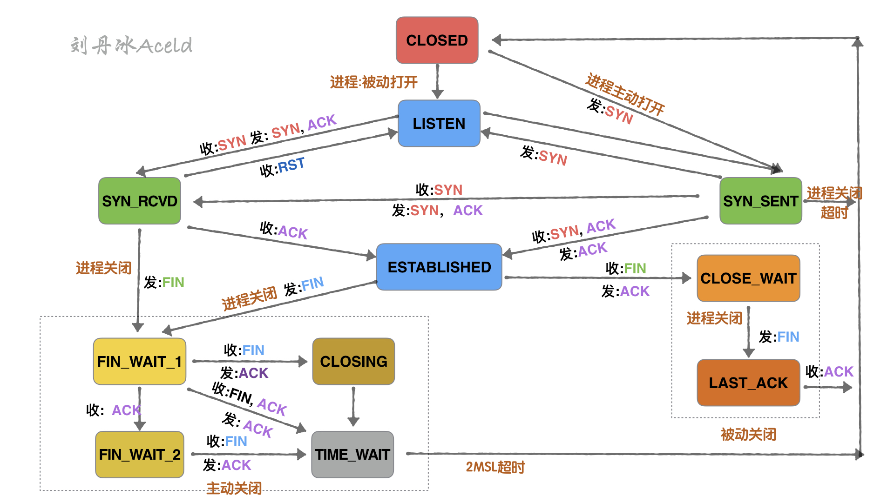
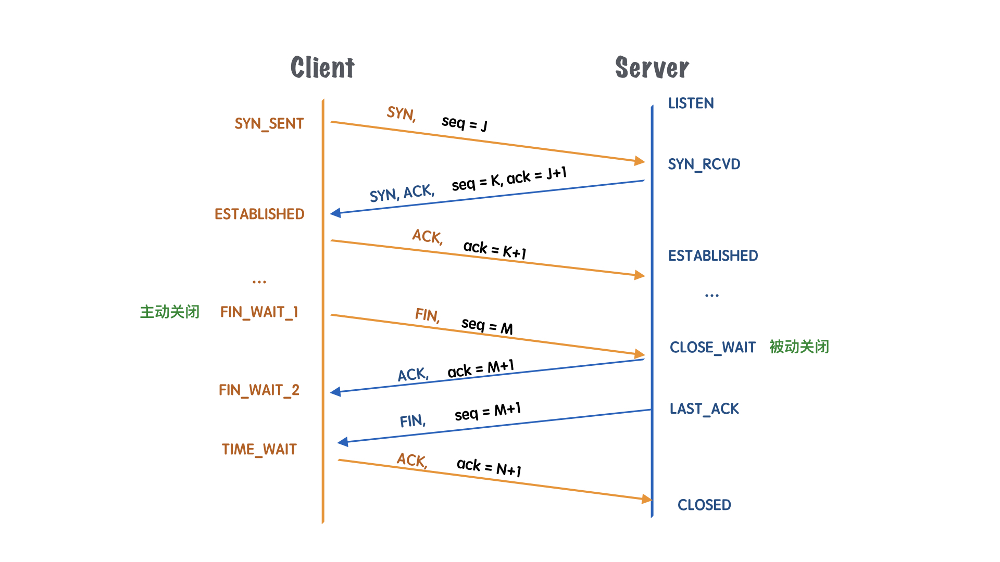
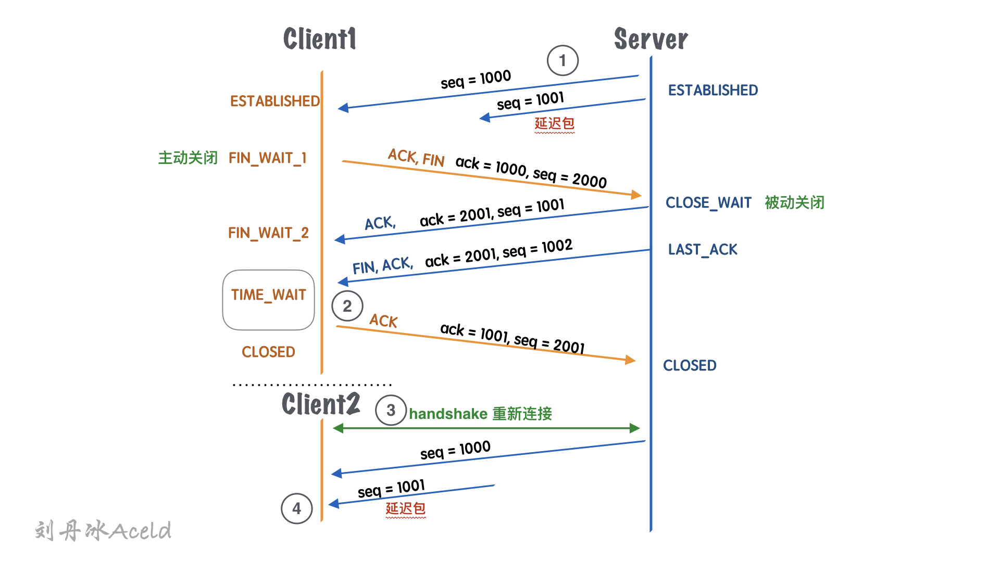
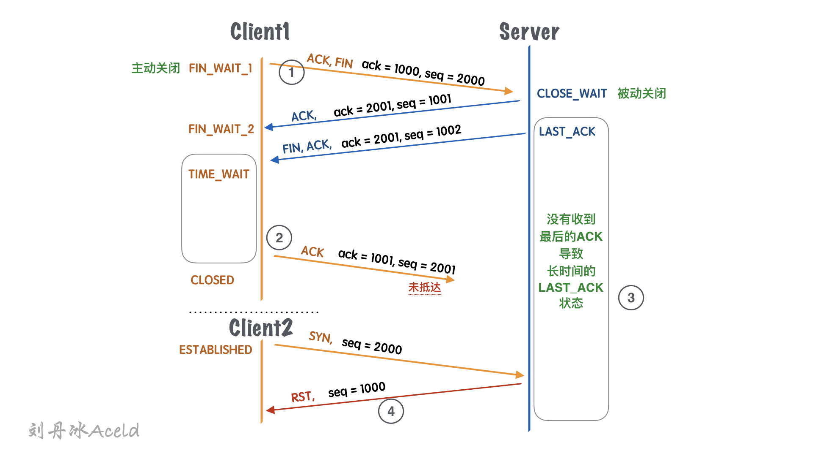

[TOC]

## 6、为什么需要TIME_WAIT

### 一、何为TIME_WAIT?

我们在日常做服务器的研发中、或者面试网络部分知识的时候，会经常问到TIME_WAIT这个词，这个词作为服务端的开发者尤为重要。TIME_WAIT是TCP协议中断开连接所经历的一种状态。

​	上图是TCP连接的状态转换，包括了一些触发条件，如果不是很直观，可以对比看下面的简图。

​	这里面作为主动关闭的一方(Client)出现了`TIME_WAIT`状态，目的是告诉Server端，**自己没有需要发送的数据**，但是它仍然**保持了接收对方数据的能力**，一个常见的关闭连接过程如下：

1、当客户端没有待发送的数据时，它会向服务端发送 `FIN` 消息，发送消息后会进入 `FIN_WAIT_1` 状态；

2、服务端接收到客户端的 `FIN` 消息后，会进入 `CLOSE_WAIT` 状态并向客户端发送 `ACK` 消息，客户端接收到 `ACK` 消息时会进入 `FIN_WAIT_2` 状态；

3、当服务端没有待发送的数据时，服务端会向客户端发送 `FIN` 消息；

4、客户端接收到 `FIN` 消息后，会进入 `TIME_WAIT` 状态并向服务端发送 `ACK` 消息，服务端收到后会进入 `CLOSED` 状态；

5、客户端等待**两个最大数据段生命周期**（Maximum segment lifetime，MSL）的时间后也会进入 `CLOSED` 状态；

---

### 二、为什么需要TIME_WAIT

**TIME_WAIT一定是发生在主动关闭一方**

被动关闭一方，会直接进入`CLOSED`状态，而主动关闭一方需要等待2*MSL时间才会最终关闭。

原因：

1、防止被动关闭方的延迟数据被人窃取

2、防止被动关闭方没有收到最后的ACK

#### 原因一：防止被动关闭方的延迟数据被人窃取

如上图所示，

1、在①中，服务端发送`seq=1001`的消息，由于网络延迟或其他原因，没有及时到达`Client1`客户端，导致整个包一直存留在网络环境的传输过程中。

2、在②中，`Client1`收到server的`FIN`包之后，变成了`TIME_WAIT`状态，这里假设`TIME_WAIT`等待的时间很短暂，那么，还没等之前的那个延迟包`seq=1001`到来，就回复给了`Server`最后一个`ACK`包。那么`Server`就会变成`CLOSED`状态。

3、在③中，相同的端口号的`Client2`的TCP链接被重用后

4、在④中，`seq=1001`的延迟包消息才发送给客户端，而这个延迟的消息却被`Client2`正常接收，主要就会给Client2带来严重的问题。所以`TIME_WAIT`不要轻易的调整，或者缩小时间，可能就会出现这种问题。

#### 原因二：防止被动关闭方没有收到最后的ACK

​	该作用就是等待足够长的时间以确定远程的TCP链接收到了其发出的终止链接消息`FIN`包的回执消息`ACK`包。

​	如上图所示：

1、在①中，`CLient1`端主动发起关闭链接，`Server`针对`Client1`的`FIN`回执了`ACK`包，然后接着发送了自己的`FIN`包，等待`Client1`回执最终的`ACK`包。

2、在②中，这里假设`TIME_WAIT`的时间不足够充分，当`Server`还没有收到 `ACK` 消息时，`Client1`就主动变成`CLOSED`状态。

3、在③中，由于`Server`一直没有等到自己`FIN`包的`ACK`应答包，导致一直处于`LAST_ACK`状态。

4、在④中，因为 服务端因为没有收到 `ACK` 消息，当`Client2`重新与`Server`建立TCP链接，认为当前连接是合法的，`CLient2`重新发送 `SYN` 消息请求握手时会收到`Server`的 `RST` 消息，连接建立的过程就会被终止。

所以，我们在默认情况下，如果客户端等待足够长的时间就会遇到以下两种情况：

1. 服务端正常收到了 `ACK` 消息并关闭当前 TCP 连接；
2. 服务端没有收到 `ACK` 消息，重新发送 `FIN` 关闭连接并等待新的 `ACK` 消息；

只要客户端等待 2 MSL 的时间，客户端和服务端之间的连接就会正常关闭，新创建的 TCP 连接收到影响的概率也微乎其微，保证了数据传输的可靠性。

