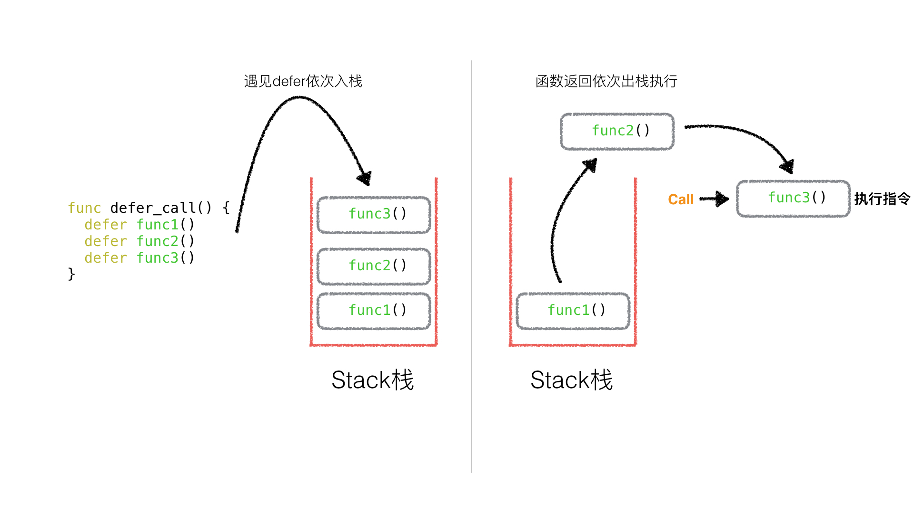
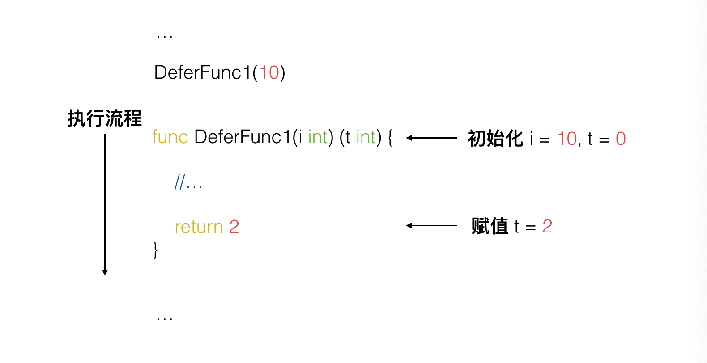
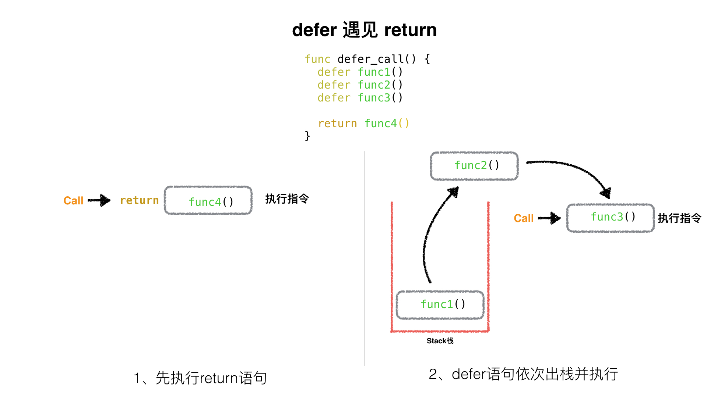
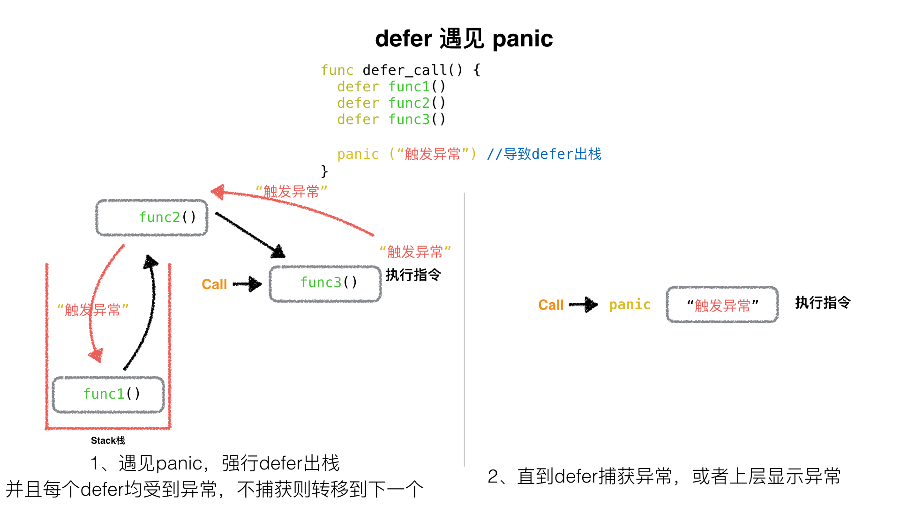

[TOC]

## 7、Golang中的Defer必掌握的7知识点

### 知识点1：defer的执行顺序

多个defer出现的时候，**它是一个“栈”的关系，也就是先进后出**。一个函数中，写在前面的defer会比写在后面的defer调用的晚。


> 示例代码

```go
package main

import "fmt"

func main() {
    defer func1()
    defer func2()
    defer func3()
}

func func1() {
    fmt.Println("A")
}

func func2() {
    fmt.Println("B")
}

func func3() {
    fmt.Println("C")
}

```




输出结果：

```bash
C
B
A
```

---

### 知识点2: defer与return谁先谁后

> 示例代码

```go
package main

import "fmt"

func deferFunc() int {
    fmt.Println("defer func called")
    return 0
}

func returnFunc() int {
    fmt.Println("return func called")
    return 0
}

func returnAndDefer() int {

    defer deferFunc()

    return returnFunc()
}

func main() {
    returnAndDefer()
}
```

执行结果为：

```bash
return func called
defer func called
```

结论为：**return之后的语句先执行，defer后的语句后执行**

---

### 知识点3：函数的返回值初始化

该知识点不属于defer本身，但是调用的场景却与defer有联系，所以也算是defer必备了解的知识点之一。

如 ： `func DeferFunc1(i int) (t int) {}`
其中返回值`t int`，这个`t`会在函数起始处被初始化为对应类型的零值并且作用域为整个函数。


> 示例代码

```go
package main

import "fmt"

func DeferFunc1(i int) (t int) {

    fmt.Println("t = ", t)

    return 2
}

func main() {
    DeferFunc11(10)
}

```

结果

```bash
t =  0
```

证明，**只要声明函数的返回值变量名称，就会在函数初始化时候为之赋值为0，而且在函数体作用域可见**。

---


### 知识点4: 有名函数返回值遇见defer情况

​		在没有defer的情况下，其实函数的返回就是与return一致的，但是有了defer就不一样了。

​		我们通过**知识点2**得知，先return，再defer，所以在执行完return之后，还要再执行defer里的语句，依然可以修改本应该返回的结果。

```go
package main

import "fmt"

func returnButDefer() (t int) {  //t初始化0， 并且作用域为该函数全域

    defer func() {
        t = t * 10
    }()

    return 1
}

func main() {
    fmt.Println(returnButDefer())
}
```

​		该`returnButDefer()`本应的返回值是`1`，但是在return之后，又被defer的匿名func函数执行，所以`t=t*10`被执行，最后`returnButDefer()`返回给上层`main()`的结果为`10`

```bash
$ go run test.go
10
```


---

### 知识点5: defer遇见panic

​		我们知道，能够触发defer的是遇见return(或函数体到末尾)和遇见panic。

​		根据**知识点2**，我们知道，defer遇见return情况如下：



​		那么，遇到panic时，遍历本协程的defer链表，并执行defer。在执行defer过程中:遇到recover则停止panic，返回recover处继续往下执行。如果没有遇到recover，遍历完本协程的defer链表后，向stderr抛出panic信息。




#### A. defer遇见panic，但是并不捕获异常的情况

> test10.go

```go
package main

import (
    "fmt"
)

func main() {
    defer_call()

    fmt.Println("main 正常结束")
}

func defer_call() {
    defer func() { fmt.Println("defer: panic 之前1") }()
    defer func() { fmt.Println("defer: panic 之前2") }()

    panic("异常内容")  //触发defer出栈

	defer func() { fmt.Println("defer: panic 之后，永远执行不到") }()
}

```

**结果**

```bash
defer: panic 之前2
defer: panic 之前1
panic: 异常内容
//... 异常堆栈信息
```


#### B. defer遇见panic，并捕获异常

```go
package main

import (
    "fmt"
)

func main() {
    defer_call()

    fmt.Println("main 正常结束")
}

func defer_call() {

    defer func() {
        fmt.Println("defer: panic 之前1, 捕获异常")
        if err := recover(); err != nil {
            fmt.Println(err)
        }
    }()

    defer func() { fmt.Println("defer: panic 之前2, 不捕获") }()

    panic("异常内容")  //触发defer出栈

	defer func() { fmt.Println("defer: panic 之后, 永远执行不到") }()
}
```

**结果**

```go
defer: panic 之前2, 不捕获
defer: panic 之前1, 捕获异常
异常内容
main 正常结束
```


**defer 最大的功能是 panic 后依然有效**
所以defer可以保证你的一些资源一定会被关闭，从而避免一些异常出现的问题。

---

### 知识点6: defer中包含panic

>  编译执行下面代码会出现什么?

> test16.go

```go
package main

import (
    "fmt"
)

func main()  {

    defer func() {
       if err := recover(); err != nil{
           fmt.Println(err)
       }else {
           fmt.Println("fatal")
       }
    }()

    defer func() {
        panic("defer panic")
    }()

    panic("panic")
}

```

**结果**

```bash
defer panic
```

**分析**

**panic仅有最后一个可以被revover捕获**。


触发`panic("panic")`后defer顺序出栈执行，第一个被执行的defer中 会有`panic("defer panic")`异常语句，这个异常将会覆盖掉main中的异常`panic("panic")`，最后这个异常被第二个执行的defer捕获到。


---

### 知识点7: defer下的函数参数包含子函数

```go
package main

import "fmt"

func function(index int, value int) int {

    fmt.Println(index)

    return index
}

func main() {
    defer function(1, function(3, 0))
    defer function(2, function(4, 0))
}

```

​		这里，有4个函数，他们的index序号分别为1，2，3，4。

那么这4个函数的先后执行顺序是什么呢？这里面有两个defer， 所以defer一共会压栈两次，先进栈1，后进栈2。 那么在压栈function1的时候，需要连同函数地址、函数形参一同进栈，那么为了得到function1的第二个参数的结果，所以就需要先执行function3将第二个参数算出，那么function3就被第一个执行。同理压栈function2，就需要执行function4算出function2第二个参数的值。然后函数结束，先出栈fuction2、再出栈function1.

​		所以顺序如下：

* defer压栈function1，压栈函数地址、形参1、形参2(调用function3) --> 打印3
* defer压栈function2，压栈函数地址、形参1、形参2(调用function4) --> 打印4
* defer出栈function2, 调用function2 --> 打印2
* defer出栈function1, 调用function1--> 打印1

```bash
3
4
2
1
```

---

### 练习：defer面试真题

了解以上6个defer的知识点，我们来验证一下网上的真题吧。

下面代码输出什么？

> test11.go

```go
package main

import "fmt"

func DeferFunc1(i int) (t int) {
    t = i
    defer func() {
        t += 3
    }()
    return t
}

func DeferFunc2(i int) int {
    t := i
    defer func() {
        t += 3
    }()
    return t
}

func DeferFunc3(i int) (t int) {
    defer func() {
        t += i
    }()
    return 2
}

func DeferFunc4() (t int) {
    defer func(i int) {
        fmt.Println(i)
        fmt.Println(t)
    }(t)
    t = 1
    return 2
}

func main() {
    fmt.Println(DeferFunc1(1))
    fmt.Println(DeferFunc2(1))
    fmt.Println(DeferFunc3(1))
    DeferFunc4()
}

```


---


### 练习题分析

#### DeferFunc1

```go
func DeferFunc1(i int) (t int) {
    t = i
    defer func() {
        t += 3
    }()
    return t
}
```

1. 将返回值t赋值为传入的i，此时t为1
2. 执行return语句将t赋值给t（等于啥也没做）
3. 执行defer方法，将t + 3 = 4
4. 函数返回 4
   因为t的作用域为整个函数所以修改有效。

#### DeferFunc2

```go
func DeferFunc2(i int) int {
    t := i
    defer func() {
        t += 3
    }()
    return t
}
```

1. 创建变量t并赋值为1
2. 执行return语句，注意这里是将t赋值给返回值，此时返回值为1（这个返回值并不是t）
3. 执行defer方法，将t + 3 = 4
4. 函数返回返回值1

也可以按照如下代码理解

```go
func DeferFunc2(i int) (result int) {
    t := i
    defer func() {
        t += 3
    }()
    return t
}
```

上面的代码return的时候相当于将t赋值给了result，当defer修改了t的值之后，对result是不会造成影响的。

#### DeferFunc3

```go
func DeferFunc3(i int) (t int) {
    defer func() {
        t += i
    }()
    return 2
}
```

1. 首先执行return将返回值t赋值为2
2. 执行defer方法将t + 1
3. 最后返回 3

#### DeferFunc4

```go
func DeferFunc4() (t int) {
    defer func(i int) {
        fmt.Println(i)
        fmt.Println(t)
    }(t)
    t = 1
    return 2
}
```

1. 初始化返回值t为零值 0
2. 首先执行defer的第一步，赋值defer中的func入参t为0
3. 执行defer的第二步，将defer压栈
4. 将t赋值为1
5. 执行return语句，将返回值t赋值为2
6. 执行defer的第三步，出栈并执行
   因为在入栈时defer执行的func的入参已经赋值了，此时它作为的是一个形式参数，所以打印为0；相对应的因为最后已经将t的值修改为2，所以再打印一个2


#### **结果**

```bash
4
1
3
0
2
```


